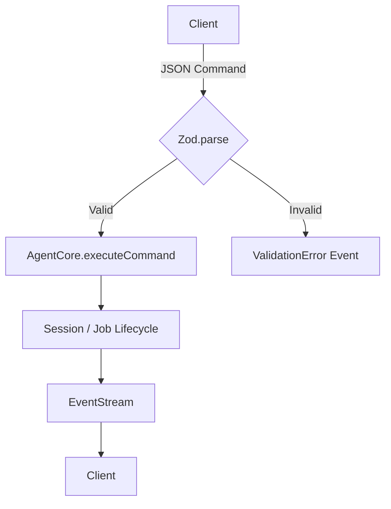

# ADR-001: Protocol Design — Discriminated Unions + Zod

**Status:** Accepted
**Date:** 2026-05-07

---

## Context

The K2 agent harness needs a typed wire protocol between core and adapters. Commands and events must be validated at runtime and discriminated at compile time.

---

## Decision

Use **Zod discriminated unions** over:
- Classes with `instanceof` checks
- Manual type guards
- JSON Schema without runtime validation

---

## Rationale

| Approach | Runtime Validation | Compile-time Discrimination | Bundle Size | Notes |
|---|---|---|---|---|
| Zod + discriminatedUnion | ✔ | ✔ | ~12KB | Single source of truth |
| Classes + instanceof | ✘ | ✔ | Larger | No runtime schema check |
| JSON Schema (ajv) | ✔ | ✘ | ~50KB | Two schemas to maintain |
| Type guards (manual) | ✘ | ✔ | Zero | Fragile, easy to drift |

---

## Consequences

- **Positive:** One schema drives both runtime validation and TypeScript inference.
- **Positive:** `z.discriminatedUnion("type", [...])` compiles to efficient switch logic.
- **Negative:** Zod error messages need custom formatting for user-facing output.
- **Negative:** Branded types (`SessionId`, `JobId`) require casting — but prevent accidental string mixing.

---

## Mermaid — Protocol Flow

