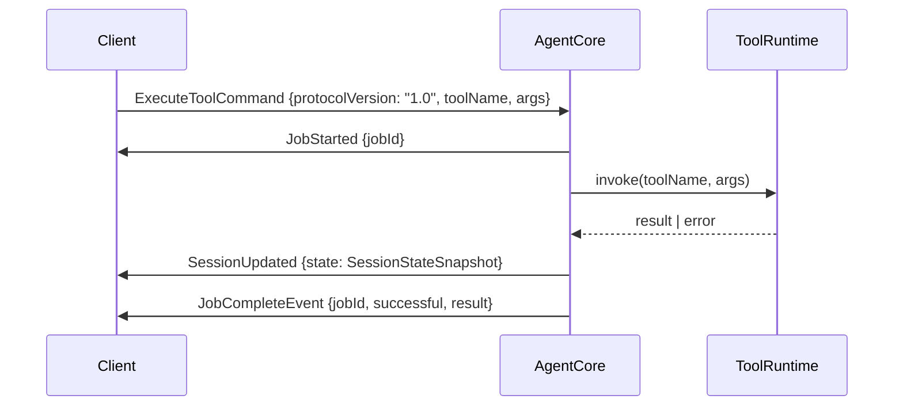
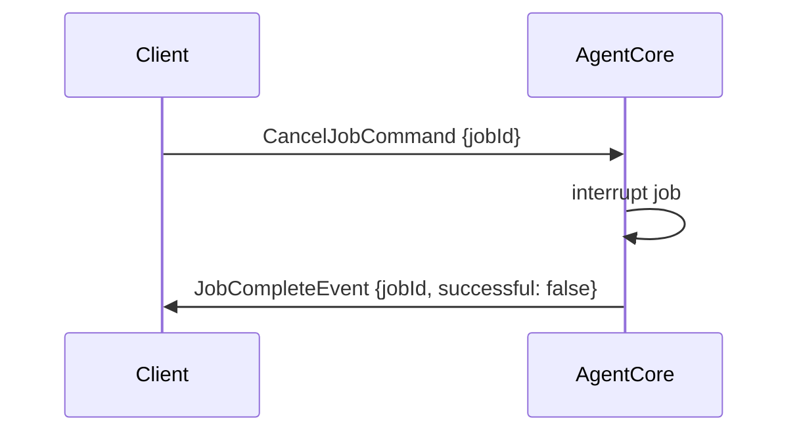

# Protocol Specification — K2 Agent Harness

**Version:** 1.0
**Date:** 2026-05-07

---

## Commands

All commands share the base field `protocolVersion: "1.0"`.

### CreateSessionCommand

| Field | Type | Description |
|---|---|---|
| `protocolVersion` | `"1.0"` | Required. Protocol lock. |
| `type` | `"CreateSession"` | Discriminant. |
| `config` | `SessionConfig` | Model, tools, system prompt config. |

### DestroySessionCommand

| Field | Type | Description |
|---|---|---|
| `protocolVersion` | `"1.0"` | Required. |
| `type` | `"DestroySession"` | Discriminant. |
| `sessionId` | `SessionId` | Target session. Idempotent. |

### ExecuteToolCommand

| Field | Type | Description |
|---|---|---|
| `protocolVersion` | `"1.0"` | Required. |
| `type` | `"ExecuteTool"` | Discriminant. |
| `sessionId` | `SessionId` | Session context. |
| `toolName` | `string` | Registered tool name. |
| `args` | `unknown` | Tool-specific arguments. |

### CancelJobCommand

| Field | Type | Description |
|---|---|---|
| `protocolVersion` | `"1.0"` | Required. |
| `type` | `"CancelJob"` | Discriminant. |
| `jobId` | `JobId` | Job to cancel. |

---

## Events

### SessionCreated

| Field | Type | Description |
|---|---|---|
| `type` | `"SessionCreated"` | Discriminant. |
| `sessionId` | `SessionId` | Assigned session ID. |
| `state` | `SessionStateSnapshot` | Initial state. |
| `timestamp` | `string` | ISO 8601. |

### SessionUpdated

| Field | Type | Description |
|---|---|---|
| `type` | `"SessionUpdated"` | Discriminant. |
| `sessionId` | `SessionId` | Affected session. |
| `state` | `SessionStateSnapshot` | Full snapshot — never partial. |
| `timestamp` | `string` | ISO 8601. |

### SessionDestroyed

| Field | Type | Description |
|---|---|---|
| `type` | `"SessionDestroyed"` | Discriminant. |
| `sessionId` | `SessionId` | Destroyed session. |
| `timestamp` | `string` | ISO 8601. |

### JobStarted

| Field | Type | Description |
|---|---|---|
| `type` | `"JobStarted"` | Discriminant. |
| `jobId` | `JobId` | Assigned job ID. |
| `sessionId` | `SessionId` | Owning session. |
| `toolName` | `string` | Tool being executed. |
| `timestamp` | `string` | ISO 8601. |

### JobCompleteEvent

| Field | Type | Description |
|---|---|---|
| `type` | `"JobComplete"` | Discriminant. |
| `jobId` | `JobId` | Completed job. |
| `sessionId` | `SessionId` | Owning session. |
| `successful` | `boolean` | `false` on cancel or error. |
| `result` | `unknown \| undefined` | Tool output if successful. |
| `error` | `string \| undefined` | Error message if failed. |
| `timestamp` | `string` | ISO 8601. |

---

## Sequence Diagram — ExecuteTool Flow

---

## Sequence Diagram — Cancel Flow

