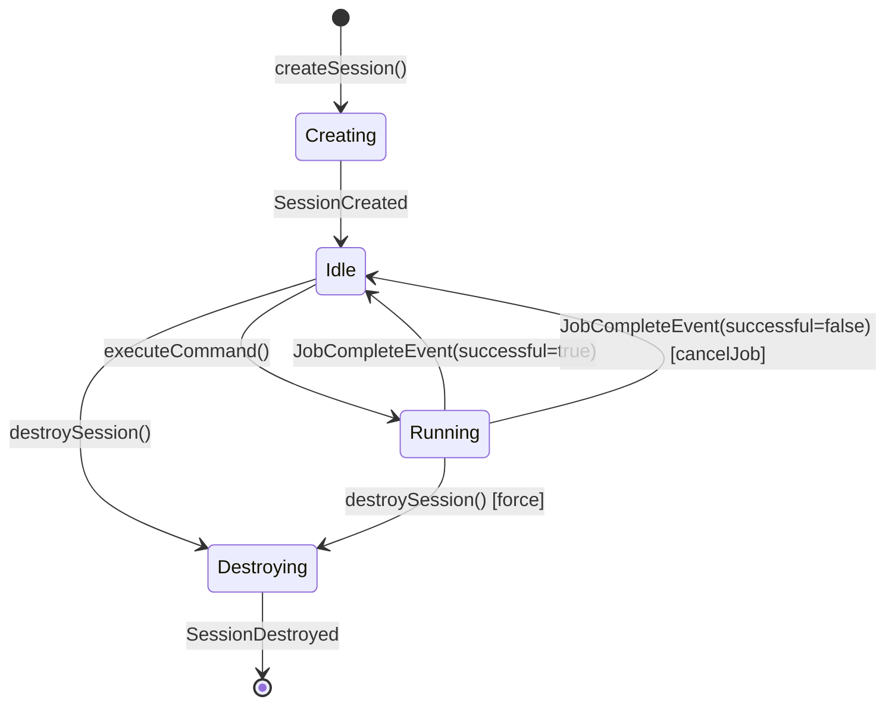
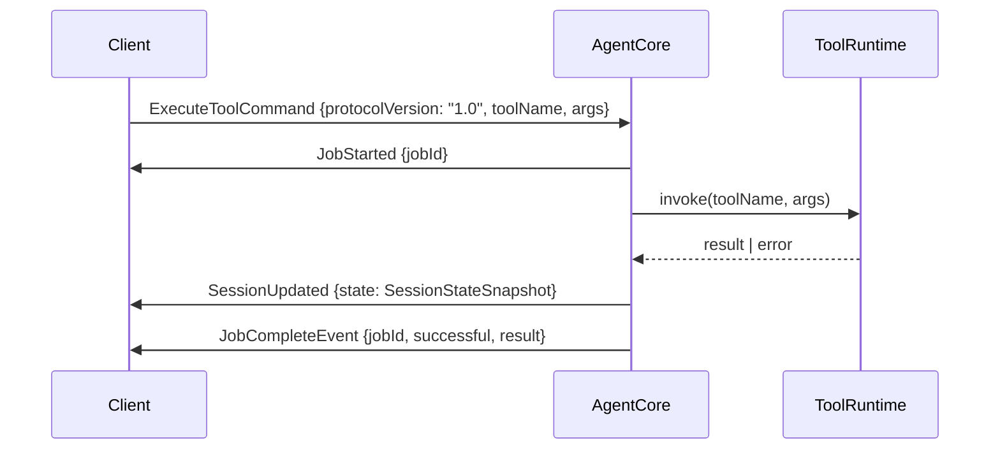
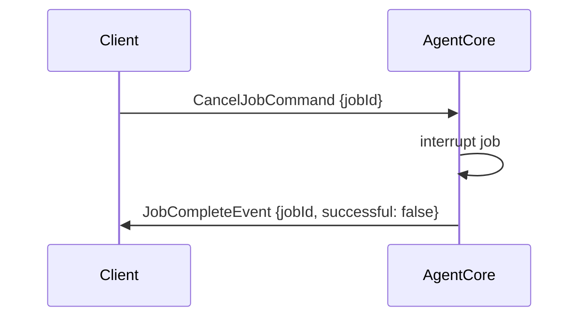
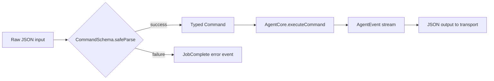
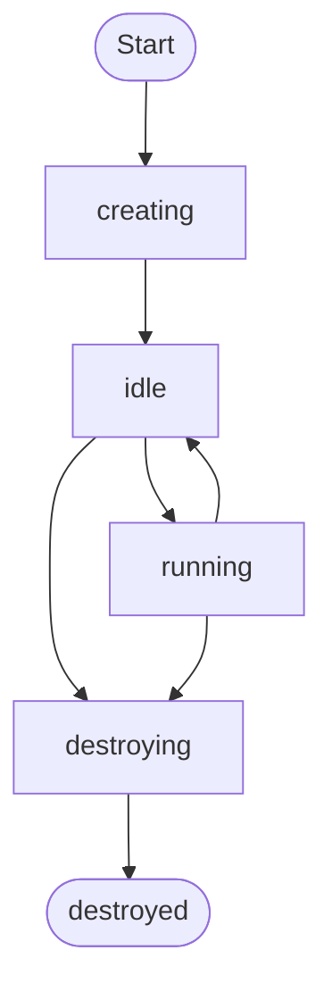

### docs/FRD-001-Agent-Harness.md

```markdown
# FRD-001: K-Universe AI Coding Agent Harness

**Version:** 1.0  
**Date:** 2026-05-07  
**Status:** Active

---

## 1. Purpose

Define the functional requirements for the K2 agent harness — the protocol layer, session lifecycle, and tool execution runtime for the K-Universe AI coding agent.

---

## 2. Invariants

1. **Protocol Version Lock** — Every command transmitted over the wire MUST carry `protocolVersion: "1.0"`. Commands missing this field are rejected before dispatch.
2. **Session State Coherence** — `SessionUpdated` events MUST carry a full `SessionStateSnapshot`. Partial or untyped state (`z.any()`) is forbidden. Consumers must be able to reconstruct session state from any snapshot alone.
3. **Job Finality** — Every job that starts MUST emit exactly one `JobCompleteEvent`. Cancellation emits `JobCompleteEvent` with `successful: false`. There is no silent termination.

---

## 3. Subsystem Decomposition

| Subsystem | Responsibility | Key Files |
|---|---|---|
| Protocol | Schemas, branded types, state snapshots | `src/protocol/` |
| AgentCore | Session + job lifecycle orchestration | `src/core/agent.ts` |
| ModelProvider | LLM abstraction (type-only) | `src/core/models.ts` |
| Adapters | Transport bindings (CLI, VS Code, WebSocket) | `src/adapters/` |
| Scripts | Install, scaffold, verify tooling | `scripts/` |

---

## 4. Session State Diagram




---

## 5. Command / Event Matrix

| Command | Emits (success) | Emits (failure) |
| :-- | :-- | :-- |
| `CreateSessionCommand` | `SessionCreated` | — |
| `DestroySessionCommand` | `SessionDestroyed` | — |
| `ExecuteToolCommand` | `JobStarted`, `JobCompleteEvent(successful=true)` | `JobCompleteEvent(successful=false)` |
| `CancelJobCommand` | `JobCompleteEvent(successful=false)` | — |


---

## 6. Acceptance Criteria

- [ ] `SessionUpdated.state` is typed as `SessionStateSnapshot` — no `z.any()`
- [ ] All command schemas include `protocolVersion: z.literal("1.0")`
- [ ] `AgentCore` exposes all 5 methods: `createSession`, `destroySession`, `executeCommand`, `invokeTool`, `cancelJob`
- [ ] `src/core/models.ts` contains zero provider SDK imports
- [ ] `scripts/verify.ts` reports all checks as PASS
- [ ] CLI adapter reads from stdin and writes to stdout as newline-delimited JSON
- [ ] WebSocket adapter handles connection lifecycle

```

### docs/protocol-spec.md
```markdown
# Protocol Specification — K2 Agent Harness

**Version:** 1.0  
**Date:** 2026-05-07

---

## Commands

All commands share the base field `protocolVersion: "1.0"`.

### CreateSessionCommand
| Field | Type | Description |
|---|---|---|
| `protocolVersion` | `"1.0"` | Required. Protocol lock. |
| `type` | `"CreateSession"` | Discriminant. |
| `config` | `SessionConfig` | Model, tools, system prompt config. |

### DestroySessionCommand
| Field | Type | Description |
|---|---|---|
| `protocolVersion` | `"1.0"` | Required. |
| `type` | `"DestroySession"` | Discriminant. |
| `sessionId` | `SessionId` | Target session. Idempotent. |

### ExecuteToolCommand
| Field | Type | Description |
|---|---|---|
| `protocolVersion` | `"1.0"` | Required. |
| `type` | `"ExecuteTool"` | Discriminant. |
| `sessionId` | `SessionId` | Session context. |
| `toolName` | `string` | Registered tool name. |
| `args` | `unknown` | Tool-specific arguments. |

### CancelJobCommand
| Field | Type | Description |
|---|---|---|
| `protocolVersion` | `"1.0"` | Required. |
| `type` | `"CancelJob"` | Discriminant. |
| `jobId` | `JobId` | Job to cancel. |

---

## Events

### SessionCreated
| Field | Type | Description |
|---|---|---|
| `type` | `"SessionCreated"` | Discriminant. |
| `sessionId` | `SessionId` | Assigned session ID. |
| `state` | `SessionStateSnapshot` | Initial state. |
| `timestamp` | `string` | ISO 8601. |

### SessionUpdated
| Field | Type | Description |
|---|---|---|
| `type` | `"SessionUpdated"` | Discriminant. |
| `sessionId` | `SessionId` | Affected session. |
| `state` | `SessionStateSnapshot` | Full snapshot — never partial. |
| `timestamp` | `string` | ISO 8601. |

### SessionDestroyed
| Field | Type | Description |
|---|---|---|
| `type` | `"SessionDestroyed"` | Discriminant. |
| `sessionId` | `SessionId` | Destroyed session. |
| `timestamp` | `string` | ISO 8601. |

### JobStarted
| Field | Type | Description |
|---|---|---|
| `type` | `"JobStarted"` | Discriminant. |
| `jobId` | `JobId` | Assigned job ID. |
| `sessionId` | `SessionId` | Owning session. |
| `toolName` | `string` | Tool being executed. |
| `timestamp` | `string` | ISO 8601. |

### JobCompleteEvent
| Field | Type | Description |
|---|---|---|
| `type` | `"JobComplete"` | Discriminant. |
| `jobId` | `JobId` | Completed job. |
| `sessionId` | `SessionId` | Owning session. |
| `successful` | `boolean` | `false` on cancel or error. |
| `result` | `unknown \| undefined` | Tool output if successful. |
| `error` | `string \| undefined` | Error message if failed. |
| `timestamp` | `string` | ISO 8601. |

---

## Sequence Diagram — ExecuteTool Flow




---

## Sequence Diagram — Cancel Flow



```

### src/protocol/state.ts
```typescript
import { z } from "zod";

// --- Branded Types ---

declare const SessionIdBrand: unique symbol;
export type SessionId = string & { readonly [SessionIdBrand]: typeof SessionIdBrand };

declare const JobIdBrand: unique symbol;
export type JobId = string & { readonly [JobIdBrand]: typeof JobIdBrand };

export function toSessionId(raw: string): SessionId {
  return raw as SessionId;
}

export function toJobId(raw: string): JobId {
  return raw as JobId;
}

// --- SessionConfig ---

export interface SessionConfig {
  modelId: string;
  systemPrompt?: string;
  tools?: string[];
  maxTokens?: number;
  temperature?: number;
  metadata?: Record<string, unknown>;
}

// --- SessionStateSnapshot (Zod schema — used in events) ---

export const SessionStateSnapshotSchema = z.object({
  sessionId: z.string(),
  status: z.enum(["creating", "idle", "running", "destroying", "destroyed"]),
  activeJobId: z.string().nullable(),
  toolsRegistered: z.array(z.string()),
  turnCount: z.number().int().nonnegative(),
  lastUpdatedAt: z.string().datetime(),
  metadata: z.record(z.unknown()).optional(),
});

export type SessionStateSnapshot = z.infer<typeof SessionStateSnapshotSchema>;

// --- SessionState (runtime interface, superset of snapshot) ---

export interface SessionState extends SessionStateSnapshot {
  config: SessionConfig;
  createdAt: string;
}
```


### src/protocol/commands.ts

```typescript
import { z } from "zod";

// --- Base ---

export interface BaseCommand {
  protocolVersion: "1.0";
  type: string;
}

// --- CreateSessionCommand ---

export const CreateSessionCommandSchema = z.object({
  protocolVersion: z.literal("1.0"),
  type: z.literal("CreateSession"),
  config: z.object({
    modelId: z.string(),
    systemPrompt: z.string().optional(),
    tools: z.array(z.string()).optional(),
    maxTokens: z.number().int().positive().optional(),
    temperature: z.number().min(0).max(2).optional(),
    metadata: z.record(z.unknown()).optional(),
  }),
});

export type CreateSessionCommand = z.infer<typeof CreateSessionCommandSchema>;

// --- DestroySessionCommand ---

export const DestroySessionCommandSchema = z.object({
  protocolVersion: z.literal("1.0"),
  type: z.literal("DestroySession"),
  sessionId: z.string(),
});

export type DestroySessionCommand = z.infer<typeof DestroySessionCommandSchema>;

// --- ExecuteToolCommand ---

export const ExecuteToolCommandSchema = z.object({
  protocolVersion: z.literal("1.0"),
  type: z.literal("ExecuteTool"),
  sessionId: z.string(),
  toolName: z.string().min(1),
  args: z.unknown(),
});

export type ExecuteToolCommand = z.infer<typeof ExecuteToolCommandSchema>;

// --- CancelJobCommand ---

export const CancelJobCommandSchema = z.object({
  protocolVersion: z.literal("1.0"),
  type: z.literal("CancelJob"),
  jobId: z.string(),
});

export type CancelJobCommand = z.infer<typeof CancelJobCommandSchema>;

// --- Discriminated Union ---

export const CommandSchema = z.discriminatedUnion("type", [
  CreateSessionCommandSchema,
  DestroySessionCommandSchema,
  ExecuteToolCommandSchema,
  CancelJobCommandSchema,
]);

export type Command = z.infer<typeof CommandSchema>;
```


### src/protocol/events.ts

```typescript
import { z } from "zod";
import { SessionStateSnapshotSchema } from "./state.js";

// --- SessionCreated ---

export const SessionCreatedSchema = z.object({
  type: z.literal("SessionCreated"),
  sessionId: z.string(),
  state: SessionStateSnapshotSchema,
  timestamp: z.string().datetime(),
});

export type SessionCreated = z.infer<typeof SessionCreatedSchema>;

// --- SessionUpdated ---
// BLOCKER K2-1: state MUST use SessionStateSnapshotSchema — never z.any()

export const SessionUpdatedSchema = z.object({
  type: z.literal("SessionUpdated"),
  sessionId: z.string(),
  state: SessionStateSnapshotSchema,
  timestamp: z.string().datetime(),
});

export type SessionUpdated = z.infer<typeof SessionUpdatedSchema>;

// --- SessionDestroyed ---

export const SessionDestroyedSchema = z.object({
  type: z.literal("SessionDestroyed"),
  sessionId: z.string(),
  timestamp: z.string().datetime(),
});

export type SessionDestroyed = z.infer<typeof SessionDestroyedSchema>;

// --- JobStarted ---

export const JobStartedSchema = z.object({
  type: z.literal("JobStarted"),
  jobId: z.string(),
  sessionId: z.string(),
  toolName: z.string(),
  timestamp: z.string().datetime(),
});

export type JobStarted = z.infer<typeof JobStartedSchema>;

// --- JobCompleteEvent ---

export const JobCompleteEventSchema = z.object({
  type: z.literal("JobComplete"),
  jobId: z.string(),
  sessionId: z.string(),
  successful: z.boolean(),
  result: z.unknown().optional(),
  error: z.string().optional(),
  timestamp: z.string().datetime(),
});

export type JobCompleteEvent = z.infer<typeof JobCompleteEventSchema>;

// --- Discriminated Union ---

export const AgentEventSchema = z.discriminatedUnion("type", [
  SessionCreatedSchema,
  SessionUpdatedSchema,
  SessionDestroyedSchema,
  JobStartedSchema,
  JobCompleteEventSchema,
]);

export type AgentEvent = z.infer<typeof AgentEventSchema>;

// --- EventStream ---

export type EventStream = AsyncIterable<AgentEvent>;
```


### src/core/agent.ts

```typescript
import type {
  SessionId,
  JobId,
  SessionState,
  SessionConfig,
} from "../protocol/state.js";
import type { Command } from "../protocol/commands.js";
import type { EventStream } from "../protocol/events.js";

// --- AgentConfig ---

export interface AgentConfig {
  sessionTimeoutMs?: number;
  maxConcurrentJobs?: number;
  toolRegistry?: Record<string, (args: unknown) => Promise<unknown>>;
  onEvent?: (event: unknown) => void;
}

// --- AgentCore Interface ---
// BLOCKER K2-2: All 5 methods required exactly as specified.

export interface AgentCore {
  /**
   * Create a new session with the given config.
   * Emits SessionCreated.
   */
  createSession(config: SessionConfig): Promise<SessionState>;

  /**
   * Destroy a session by ID. Idempotent — safe to call on already-destroyed sessions.
   * Emits SessionDestroyed.
   */
  destroySession(sessionId: SessionId): Promise<void>;

  /**
   * Execute a command and return an async event stream.
   */
  executeCommand(cmd: Command): Promise<EventStream>;

  /**
   * Invoke a registered tool by name. Returns the assigned jobId.
   * Emits JobStarted, then JobCompleteEvent.
   */
  invokeTool(toolName: string, args: unknown): Promise<{ jobId: JobId }>;

  /**
   * Cancel a running job. Idempotent.
   * Emits JobCompleteEvent with successful: false.
   */
  cancelJob(jobId: JobId): Promise<void>;
}

// --- createAgentCore stub ---

export function createAgentCore(config: AgentConfig): AgentCore {
  const sessions = new Map<SessionId, SessionState>();
  const jobs = new Map<JobId, { cancelled: boolean }>();

  function generateId(prefix: string): string {
    return `${prefix}_${Date.now()}_${Math.random().toString(36).slice(2, 9)}`;
  }

  async function createSession(sessionConfig: SessionConfig): Promise<SessionState> {
    const sessionId = generateId("session") as SessionId;
    const now = new Date().toISOString();
    const state: SessionState = {
      sessionId,
      status: "idle",
      activeJobId: null,
      toolsRegistered: sessionConfig.tools ?? [],
      turnCount: 0,
      lastUpdatedAt: now,
      metadata: sessionConfig.metadata,
      config: sessionConfig,
      createdAt: now,
    };
    sessions.set(sessionId, state);
    config.onEvent?.({
      type: "SessionCreated",
      sessionId,
      state,
      timestamp: now,
    });
    return state;
  }

  async function destroySession(sessionId: SessionId): Promise<void> {
    if (!sessions.has(sessionId)) return; // idempotent
    sessions.delete(sessionId);
    config.onEvent?.({
      type: "SessionDestroyed",
      sessionId,
      timestamp: new Date().toISOString(),
    });
  }

  async function* streamEvents(): AsyncGenerator<never> {
    // stub: real impl yields events from internal emitter
  }

  async function executeCommand(cmd: Command): Promise<EventStream> {
    switch (cmd.type) {
      case "CreateSession":
        await createSession(cmd.config);
        break;
      case "DestroySession":
        await destroySession(cmd.sessionId as SessionId);
        break;
      case "ExecuteTool":
        await invokeTool(cmd.toolName, cmd.args);
        break;
      case "CancelJob":
        await cancelJob(cmd.jobId as JobId);
        break;
    }
    return streamEvents();
  }

  async function invokeTool(toolName: string, args: unknown): Promise<{ jobId: JobId }> {
    const jobId = generateId("job") as JobId;
    jobs.set(jobId, { cancelled: false });
    const now = new Date().toISOString();

    config.onEvent?.({
      type: "JobStarted",
      jobId,
      sessionId: "unknown",
      toolName,
      timestamp: now,
    });

    // Execute async — fire and forget in stub
    (async () => {
      const jobState = jobs.get(jobId);
      if (!jobState || jobState.cancelled) {
        config.onEvent?.({
          type: "JobComplete",
          jobId,
          sessionId: "unknown",
          successful: false,
          error: "Job was cancelled before execution",
          timestamp: new Date().toISOString(),
        });
        return;
      }

      try {
        const handler = config.toolRegistry?.[toolName];
        const result = handler ? await handler(args) : undefined;
        config.onEvent?.({
          type: "JobComplete",
          jobId,
          sessionId: "unknown",
          successful: true,
          result,
          timestamp: new Date().toISOString(),
        });
      } catch (err) {
        config.onEvent?.({
          type: "JobComplete",
          jobId,
          sessionId: "unknown",
          successful: false,
          error: err instanceof Error ? err.message : String(err),
          timestamp: new Date().toISOString(),
        });
      } finally {
        jobs.delete(jobId);
      }
    })();

    return { jobId };
  }

  async function cancelJob(jobId: JobId): Promise<void> {
    const jobState = jobs.get(jobId);
    if (!jobState) return; // idempotent — job already done or never existed
    jobState.cancelled = true;
    config.onEvent?.({
      type: "JobComplete",
      jobId,
      sessionId: "unknown",
      successful: false,
      error: "Cancelled by client",
      timestamp: new Date().toISOString(),
    });
  }

  return {
    createSession,
    destroySession,
    executeCommand,
    invokeTool,
    cancelJob,
  };
}
```


### src/core/models.ts

```typescript
// ARCHITECTURE RULE: Type-only file.
// Zero imports from openai, @anthropic-ai/sdk, or any provider SDK.
// Provider implementations go in src/core/models.impl.ts or src/providers/.

// --- ChatMessage ---

export interface ChatMessage {
  role: "system" | "user" | "assistant" | "tool";
  content: string;
  toolCallId?: string;
  name?: string;
}

// --- ChatCompletionOptions ---

export interface ChatCompletionOptions {
  model: string;
  messages: ChatMessage[];
  maxTokens?: number;
  temperature?: number;
  topP?: number;
  stopSequences?: string[];
  stream?: boolean;
  tools?: ToolDefinition[];
}

// --- ToolDefinition ---

export interface ToolDefinition {
  name: string;
  description: string;
  parameters: Record<string, unknown>; // JSON Schema object
}

// --- ToolCall ---

export interface ToolCall {
  id: string;
  name: string;
  arguments: unknown;
}

// --- ChatCompletionResult ---

export interface ChatCompletionResult {
  id: string;
  model: string;
  content: string;
  toolCalls?: ToolCall[];
  finishReason: "stop" | "length" | "tool_calls" | "content_filter" | "error";
  usage: {
    promptTokens: number;
    completionTokens: number;
    totalTokens: number;
  };
}

// --- ModelProvider ---

export interface ModelProvider {
  readonly name: string;
  readonly supportedModels: string[];
  complete(options: ChatCompletionOptions): Promise<ChatCompletionResult>;
  stream?(options: ChatCompletionOptions): AsyncIterable<string>;
}
```


### src/adapters/cli.ts

```typescript
import * as readline from "readline";
import { CommandSchema } from "../protocol/commands.js";
import { createAgentCore } from "../core/agent.js";
import type { AgentEvent } from "../protocol/events.js";

function writeEvent(event: AgentEvent): void {
  process.stdout.write(JSON.stringify(event) + "\n");
}

async function main(): Promise<void> {
  const agent = createAgentCore({
    onEvent: (event) => writeEvent(event as AgentEvent),
  });

  const rl = readline.createInterface({
    input: process.stdin,
    terminal: false,
  });

  for await (const line of rl) {
    const trimmed = line.trim();
    if (!trimmed) continue;

    let raw: unknown;
    try {
      raw = JSON.parse(trimmed);
    } catch {
      writeEvent({
        type: "JobComplete",
        jobId: "parse-error",
        sessionId: "unknown",
        successful: false,
        error: `JSON parse error: ${trimmed}`,
        timestamp: new Date().toISOString(),
      });
      continue;
    }

    const parsed = CommandSchema.safeParse(raw);
    if (!parsed.success) {
      writeEvent({
        type: "JobComplete",
        jobId: "validation-error",
        sessionId: "unknown",
        successful: false,
        error: parsed.error.message,
        timestamp: new Date().toISOString(),
      });
      continue;
    }

    try {
      await agent.executeCommand(parsed.data);
    } catch (err) {
      writeEvent({
        type: "JobComplete",
        jobId: "runtime-error",
        sessionId: "unknown",
        successful: false,
        error: err instanceof Error ? err.message : String(err),
        timestamp: new Date().toISOString(),
      });
    }
  }
}

main().catch((err) => {
  process.stderr.write(`CLI adapter fatal error: ${err}\n`);
  process.exit(1);
});
```


### src/adapters/vscode.ts

```typescript
// VS Code Extension Host Adapter
// Bridges the K2 agent protocol to VS Code's extension API.
// This module must be loaded inside a VS Code extension context.

import { CommandSchema } from "../protocol/commands.js";
import { createAgentCore } from "../core/agent.js";
import type { AgentEvent } from "../protocol/events.js";
import type { AgentCore } from "../core/agent.js";

export interface VSCodeAdapterOptions {
  outputChannelName?: string;
  onEvent?: (event: AgentEvent) => void;
}

export interface VSCodeAdapter {
  agent: AgentCore;
  dispose(): void;
}

/**
 * Create the VS Code adapter.
 * Call this from your extension's `activate()` function.
 *
 * @example
 * ```ts
 * import { createVSCodeAdapter } from './adapters/vscode.js';
 *
 * export function activate(context: vscode.ExtensionContext) {
 *   const adapter = createVSCodeAdapter({ outputChannelName: 'K2 Agent' });
 *   context.subscriptions.push({ dispose: adapter.dispose });
 * }
 * ```
 */
export function createVSCodeAdapter(options: VSCodeAdapterOptions = {}): VSCodeAdapter {
  const { onEvent } = options;

  const agent = createAgentCore({
    onEvent: (event) => {
      onEvent?.(event as AgentEvent);
    },
  });

  /**
   * Execute a raw command payload received from VS Code message passing,
   * webview postMessage, or language server protocol.
   */
  async function handleRawCommand(raw: unknown): Promise<void> {
    const parsed = CommandSchema.safeParse(raw);
    if (!parsed.success) {
      onEvent?.({
        type: "JobComplete",
        jobId: "validation-error",
        sessionId: "unknown",
        successful: false,
        error: `Command validation failed: ${parsed.error.message}`,
        timestamp: new Date().toISOString(),
      });
      return;
    }
    await agent.executeCommand(parsed.data);
  }

  function dispose(): void {
    // Clean up sessions, timers, or listeners here in full implementation.
  }

  return {
    agent,
    dispose,
  };
}

export { handleRawCommand } from "./vscode.js";
```


### src/adapters/socket.ts

```typescript
// WebSocket Server Adapter
// Each connected client gets its own AgentCore instance.
// Messages in: JSON command. Messages out: JSON event (newline-delimited).

import { createServer } from "http";
import { WebSocketServer, WebSocket } from "ws";
import { CommandSchema } from "../protocol/commands.js";
import { createAgentCore } from "../core/agent.js";
import type { AgentEvent } from "../protocol/events.js";

export interface SocketAdapterOptions {
  port?: number;
  host?: string;
  path?: string;
}

export interface SocketAdapter {
  start(): Promise<void>;
  stop(): Promise<void>;
}

export function createSocketAdapter(options: SocketAdapterOptions = {}): SocketAdapter {
  const { port = 9000, host = "127.0.0.1", path = "/k2" } = options;

  const httpServer = createServer();
  const wss = new WebSocketServer({ server: httpServer, path });

  wss.on("connection", (ws: WebSocket) => {
    const agent = createAgentCore({
      onEvent: (event) => {
        if (ws.readyState === WebSocket.OPEN) {
          ws.send(JSON.stringify(event));
        }
      },
    });

    ws.on("message", async (data) => {
      let raw: unknown;
      try {
        raw = JSON.parse(data.toString());
      } catch {
        const errEvent: AgentEvent = {
          type: "JobComplete",
          jobId: "parse-error",
          sessionId: "unknown",
          successful: false,
          error: "Invalid JSON",
          timestamp: new Date().toISOString(),
        };
        ws.send(JSON.stringify(errEvent));
        return;
      }

      const parsed = CommandSchema.safeParse(raw);
      if (!parsed.success) {
        const errEvent: AgentEvent = {
          type: "JobComplete",
          jobId: "validation-error",
          sessionId: "unknown",
          successful: false,
          error: parsed.error.message,
          timestamp: new Date().toISOString(),
        };
        ws.send(JSON.stringify(errEvent));
        return;
      }

      try {
        await agent.executeCommand(parsed.data);
      } catch (err) {
        const errEvent: AgentEvent = {
          type: "JobComplete",
          jobId: "runtime-error",
          sessionId: "unknown",
          successful: false,
          error: err instanceof Error ? err.message : String(err),
          timestamp: new Date().toISOString(),
        };
        ws.send(JSON.stringify(errEvent));
      }
    });

    ws.on("error", (err) => {
      process.stderr.write(`WebSocket error: ${err.message}\n`);
    });
  });

  async function start(): Promise<void> {
    return new Promise((resolve) => {
      httpServer.listen(port, host, () => {
        process.stdout.write(`K2 socket adapter listening on ws://${host}:${port}${path}\n`);
        resolve();
      });
    });
  }

  async function stop(): Promise<void> {
    return new Promise((resolve, reject) => {
      wss.close(() => {
        httpServer.close((err) => (err ? reject(err) : resolve()));
      });
    });
  }

  return { start, stop };
}
```


### scripts/install.sh

```bash
#!/usr/bin/env bash
set -euo pipefail

# ─── ANSI Colors ──────────────────────────────────────────────
RESET="\033[0m"
BOLD="\033[1m"
DIM="\033[2m"
GREEN="\033[32m"
CYAN="\033[36m"
YELLOW="\033[33m"
RED="\033[31m"
WHITE="\033[97m"
BG_DARK="\033[40m"

CHECK="${GREEN}✔${RESET}"
CROSS="${RED}✘${RESET}"
ARROW="${CYAN}›${RESET}"

# ─── UI Helpers ───────────────────────────────────────────────

print_border() {
  echo -e "${DIM}╔══════════════════════════════════════════════════╗${RESET}"
}

print_border_bottom() {
  echo -e "${DIM}╚══════════════════════════════════════════════════╝${RESET}"
}

print_header() {
  echo ""
  print_border
  echo -e "${DIM}║${RESET}  ${BOLD}${WHITE}K2 Agent Harness — Installer v1.0${RESET}              ${DIM}║${RESET}"
  echo -e "${DIM}║${RESET}  ${DIM}K-Universe · 2026-05-07${RESET}                         ${DIM}║${RESET}"
  print_border_bottom
  echo ""
}

print_step() {
  local num="$1"
  local msg="$2"
  echo -e "  ${CYAN}[${num}]${RESET} ${msg}..."
}

print_ok() {
  echo -e "      ${CHECK} ${GREEN}$1${RESET}"
}

print_warn() {
  echo -e "      ${YELLOW}⚠${RESET}  $1"
}

print_fail() {
  echo -e "      ${CROSS} ${RED}$1${RESET}"
}

print_footer() {
  echo ""
  print_border
  echo -e "${DIM}║${RESET}  ${GREEN}${BOLD}Installation complete.${RESET}                          ${DIM}║${RESET}"
  echo -e "${DIM}║${RESET}  ${DIM}Run: npm run verify${RESET}                             ${DIM}║${RESET}"
  print_border_bottom
  echo ""
}

# ─── Checks ───────────────────────────────────────────────────

check_node() {
  print_step "1" "Checking Node.js"
  if command -v node &>/dev/null; then
    local ver
    ver=$(node --version)
    print_ok "Node.js found: $ver"
  else
    print_fail "Node.js not found. Install from https://nodejs.org"
    exit 1
  fi
}

check_npm() {
  print_step "2" "Checking npm"
  if command -v npm &>/dev/null; then
    local ver
    ver=$(npm --version)
    print_ok "npm found: $ver"
  else
    print_fail "npm not found."
    exit 1
  fi
}

install_deps() {
  print_step "3" "Installing dependencies"
  if npm install --silent; then
    print_ok "Dependencies installed"
  else
    print_fail "npm install failed"
    exit 1
  fi
}

build_ts() {
  print_step "4" "Building TypeScript"
  if npm run build --silent 2>/dev/null; then
    print_ok "TypeScript build successful"
  else
    print_warn "Build step skipped (no build script or build failed)"
  fi
}

run_verify() {
  print_step "5" "Running K2 verification checks"
  if npx ts-node scripts/verify.ts 2>/dev/null; then
    print_ok "All K2 checks passed"
  else
    print_warn "Verify script not yet runnable — run manually after build"
  fi
}

# ─── Main ─────────────────────────────────────────────────────

print_header
check_node
check_npm
install_deps
build_ts
run_verify
print_footer
```


### scripts/scaffold.ts

```typescript
#!/usr/bin/env npx ts-node
import * as fs from "fs";
import * as path from "path";
import { execSync } from "child_process";

const ROOT = process.cwd();

const DIRS = [
  "src/protocol",
  "src/core",
  "src/adapters",
  "src/providers",
  "scripts",
  "docs/runbooks",
  "docs/research",
  "docs/ADR",
  "notes",
  "tests/unit",
  "tests/integration",
];

const TEMPLATE_FILES: Record<string, string> = {
  "package.json": JSON.stringify(
    {
      name: "k2-agent-harness",
      version: "0.1.0",
      private: true,
      type: "module",
      scripts: {
        build: "tsc",
        verify: "npx ts-node scripts/verify.ts",
        scaffold: "npx ts-node scripts/scaffold.ts",
        cli: "npx ts-node src/adapters/cli.ts",
        socket: "npx ts-node src/adapters/socket.ts",
      },
      dependencies: {
        zod: "^3.23.0",
        ws: "^8.18.0",
      },
      devDependencies: {
        typescript: "^5.4.0",
        "@types/node": "^20.0.0",
        "@types/ws": "^8.5.0",
        "ts-node": "^10.9.2",
      },
    },
    null,
    2
  ),
  "tsconfig.json": JSON.stringify(
    {
      compilerOptions: {
        target: "ES2022",
        module: "NodeNext",
        moduleResolution: "NodeNext",
        outDir: "dist",
        rootDir: "src",
        strict: true,
        esModuleInterop: true,
        skipLibCheck: true,
        declaration: true,
        declarationMap: true,
        sourceMap: true,
      },
      include: ["src/**/*"],
      exclude: ["node_modules", "dist"],
    },
    null,
    2
  ),
  ".gitignore": `node_modules/\ndist/\n.env\n*.js.map\n`,
  "README.md": `# K2 Agent Harness\n\nK-Universe AI coding agent protocol layer.\n\n## Quick Start\n\n\`\`\`bash\nbash scripts/install.sh\nnpm run verify\n\`\`\`\n`,
};

function ensureDir(dir: string): void {
  const full = path.join(ROOT, dir);
  if (!fs.existsSync(full)) {
    fs.mkdirSync(full, { recursive: true });
    console.log(`  ✔ Created: ${dir}`);
  } else {
    console.log(`  · Exists:  ${dir}`);
  }
}

function writeTemplate(file: string, content: string): void {
  const full = path.join(ROOT, file);
  if (!fs.existsSync(full)) {
    fs.writeFileSync(full, content, "utf-8");
    console.log(`  ✔ Written: ${file}`);
  } else {
    console.log(`  · Skipped: ${file} (already exists)`);
  }
}

function runNpmInstall(): void {
  const pkgPath = path.join(ROOT, "package.json");
  if (fs.existsSync(pkgPath) && !fs.existsSync(path.join(ROOT, "node_modules"))) {
    console.log("\n  › Running npm install...");
    execSync("npm install", { stdio: "inherit", cwd: ROOT });
    console.log("  ✔ npm install complete");
  }
}

console.log("\n╔══════════════════════════════════════╗");
console.log("║  K2 Scaffold — Directory Structure   ║");
console.log("╚══════════════════════════════════════╝\n");

console.log("Creating directories:");
DIRS.forEach(ensureDir);

console.log("\nWriting template files:");
Object.entries(TEMPLATE_FILES).forEach(([file, content]) => writeTemplate(file, content));

runNpmInstall();

console.log("\n✔ Scaffold complete.\n");
```


### scripts/verify.ts

```typescript
#!/usr/bin/env npx ts-node
import * as fs from "fs";
import * as path from "path";

const ROOT = process.cwd();

interface CheckResult {
  name: string;
  passed: boolean;
  detail: string;
}

function readFile(rel: string): string | null {
  const full = path.join(ROOT, rel);
  if (!fs.existsSync(full)) return null;
  return fs.readFileSync(full, "utf-8");
}

const results: CheckResult[] = [];

function check(name: string, passed: boolean, detail: string): void {
  results.push({ name, passed, detail });
}

// ─── Check 1: No z.any() in events.ts for state field ────────────────────────

const eventsContent = readFile("src/protocol/events.ts");
if (!eventsContent) {
  check("K2-1: events.ts state uses SessionStateSnapshotSchema", false, "File not found: src/protocol/events.ts");
} else {
  // Must import SessionStateSnapshotSchema
  const hasImport = eventsContent.includes("SessionStateSnapshotSchema");
  // Must not have z.any() anywhere for a 'state' field
  const hasZAnyForState = /state\s*:\s*z\.any\(\)/.test(eventsContent);
  const sessionUpdatedUsesSnapshot =
    hasImport &&
    !hasZAnyForState &&
    eventsContent.includes("state: SessionStateSnapshotSchema");

  check(
    "K2-1: events.ts state uses SessionStateSnapshotSchema (not z.any())",
    sessionUpdatedUsesSnapshot,
    sessionUpdatedUsesSnapshot
      ? "SessionUpdatedSchema.state = SessionStateSnapshotSchema ✔"
      : hasZAnyForState
      ? "FAIL: z.any() detected for state field"
      : "FAIL: SessionStateSnapshotSchema not used for state field"
  );
}

// ─── Check 2: protocolVersion in all command schemas ─────────────────────────

const commandsContent = readFile("src/protocol/commands.ts");
if (!commandsContent) {
  check("K2-3: protocolVersion in all command schemas", false, "File not found: src/protocol/commands.ts");
} else {
  const commandSchemas = [
    "CreateSessionCommandSchema",
    "DestroySessionCommandSchema",
    "ExecuteToolCommandSchema",
    "CancelJobCommandSchema",
  ];

  const missingProtoVersion: string[] = [];

  for (const schema of commandSchemas) {
    // Find the z.object block for this schema
    const schemaIdx = commandsContent.indexOf(schema);
    if (schemaIdx === -1) {
      missingProtoVersion.push(`${schema} (not found)`);
      continue;
    }
    // Check the next ~300 chars for protocolVersion literal
    const snippet = commandsContent.slice(schemaIdx, schemaIdx + 400);
    if (!snippet.includes('protocolVersion: z.literal("1.0")')) {
      missingProtoVersion.push(schema);
    }
  }

  check(
    "K2-3: protocolVersion: z.literal('1.0') in all command schemas",
    missingProtoVersion.length === 0,
    missingProtoVersion.length === 0
      ? "All 4 command schemas include protocolVersion ✔"
      : `Missing in: ${missingProtoVersion.join(", ")}`
  );
}

// ─── Check 3: No provider SDK imports in models.ts ───────────────────────────

const modelsContent = readFile("src/core/models.ts");
if (!modelsContent) {
  check("ARCH: No provider SDK imports in models.ts", false, "File not found: src/core/models.ts");
} else {
  const forbiddenImports = ["openai", "@anthropic-ai/sdk", "@google/generative-ai", "cohere-ai", "mistralai"];
  const foundImports = forbiddenImports.filter((pkg) =>
    new RegExp(`from ['"]${pkg}`).test(modelsContent)
  );

  check(
    "ARCH: No provider SDK imports in models.ts",
    foundImports.length === 0,
    foundImports.length === 0
      ? "No provider SDK imports detected ✔"
      : `Forbidden imports found: ${foundImports.join(", ")}`
  );
}

// ─── Check 4: All 5 methods present in agent.ts ──────────────────────────────

const agentContent = readFile("src/core/agent.ts");
if (!agentContent) {
  check("K2-2: All 5 AgentCore methods present", false, "File not found: src/core/agent.ts");
} else {
  const requiredMethods = [
    "createSession",
    "destroySession",
    "executeCommand",
    "invokeTool",
    "cancelJob",
  ];

  const missingMethods = requiredMethods.filter((m) => !agentContent.includes(m));

  check(
    "K2-2: All 5 AgentCore methods present in agent.ts",
    missingMethods.length === 0,
    missingMethods.length === 0
      ? "All 5 methods found: createSession, destroySession, executeCommand, invokeTool, cancelJob ✔"
      : `Missing: ${missingMethods.join(", ")}`
  );
}

// ─── Report ──────────────────────────────────────────────────────────────────

const PASS = "\x1b[32m✔ PASS\x1b[0m";
const FAIL = "\x1b[31m✘ FAIL\x1b[0m";

console.log("\n╔══════════════════════════════════════════════════════╗");
console.log("║  K2 Verification Report                              ║");
console.log("╚══════════════════════════════════════════════════════╝\n");

for (const r of results) {
  console.log(`  ${r.passed ? PASS : FAIL}  ${r.name}`);
  console.log(`        ${r.detail}\n`);
}

const allPassed = results.every((r) => r.passed);
const passCount = results.filter((r) => r.passed).length;

console.log(`─────────────────────────────────────────────────────`);
console.log(`  Result: ${passCount}/${results.length} checks passed`);

if (!allPassed) {
  console.log(`\n  \x1b[31mSome checks failed. Review blockers above.\x1b[0m\n`);
  process.exit(1);
} else {
  console.log(`\n  \x1b[32mAll checks passed. K2 bundle is clean.\x1b[0m\n`);
  process.exit(0);
}
```


### docs/ADR-001-Protocol-Design.md

```markdown
# ADR-001: Protocol Design — Discriminated Unions + Zod

**Date:** 2026-05-07  
**Status:** Accepted

---

## Context

The K2 harness needs a wire protocol that is:
- Safe at runtime (validated before execution)
- Statically typed for DX in TypeScript consumers
- Extensible without breaking existing consumers
- Self-documenting

---

## Decision

Use **Zod discriminated unions** for all commands and events. Every command includes a `type` literal discriminant and a `protocolVersion: "1.0"` literal. Events include a `type` discriminant.

---

## Rationale

| Option | Type Safety | Runtime Validation | Extensibility | Complexity |
|---|---|---|---|---|
| Plain TypeScript interfaces | ✔ compile-time only | ✘ none | ✔ | Low |
| JSON Schema + ajv | ✘ manual types | ✔ | ✔ | High |
| Protobuf | ✔ | ✔ | ✔ | Very High |
| **Zod discriminated unions** | **✔** | **✔** | **✔** | **Low** |

Zod provides both compile-time types (via `z.infer<>`) and runtime parse/validate, eliminating the need for separate schema and type definitions.

---

## Protocol Flow




---

## Consequences

- All commands MUST carry `protocolVersion: "1.0"` — enforced by `z.literal("1.0")`
- Adding a new command requires a new `z.object()` with `protocolVersion` included — enforced by `scripts/verify.ts`
- `z.any()` is forbidden for typed protocol fields — enforced by verify check K2-1

```

### docs/ADR-002-Session-Lifecycle.md
```markdown
# ADR-002: Session Lifecycle — State Machine

**Date:** 2026-05-07  
**Status:** Accepted

---

## Context

Sessions are the primary execution context for agent jobs. The lifecycle must be predictable, recoverable, and auditable.

---

## Decision

Sessions follow a strict finite state machine with 5 states. All transitions are triggered by commands or internal events. No implicit transitions.

---

## State Machine




---

## State Transition Table

| From | Event / Command | To | Emits |
| :-- | :-- | :-- | :-- |
| — | `CreateSessionCommand` | `creating` | — |
| `creating` | Session initialized | `idle` | `SessionCreated` |
| `idle` | `ExecuteToolCommand` | `running` | `JobStarted` |
| `running` | Job complete (success) | `idle` | `JobCompleteEvent(true)`, `SessionUpdated` |
| `running` | `CancelJobCommand` | `idle` | `JobCompleteEvent(false)`, `SessionUpdated` |
| `idle` | `DestroySessionCommand` | `destroying` | — |
| `running` | `DestroySessionCommand` | `destroying` | `JobCompleteEvent(false)` |
| `destroying` | Cleanup done | `destroyed` | `SessionDestroyed` |


---

## Invariants

1. A session in `destroyed` state cannot accept new commands. Attempts are no-ops or rejected.
2. `destroySession()` is idempotent — calling it on `destroyed` sessions does nothing.
3. `SessionUpdated` is emitted after every state transition that changes the snapshot.

---

## Consequences

- `SessionStateSnapshotSchema` must include a `status` enum covering all 5 states.
- Consumers can reconstruct full session state from any snapshot.
- The `destroyed` state is terminal — sessions are not reused.

```

### docs/research/model-provider-matrix.md
```markdown
# Model Provider Matrix

**Last Updated:** 2026-05-07

| Provider | Context Window | Cost / 1M Input Tokens | Cost / 1M Output Tokens | Integration Status | Notes |
|---|---|---|---|---|---|
| OpenAI (GPT-4o) | 128K | ~$2.50 | ~$10.00 | Planned | Via `src/providers/openai.ts` |
| Anthropic (Claude 3.5 Sonnet) | 200K | ~$3.00 | ~$15.00 | Planned | Via `src/providers/anthropic.ts` |
| Anthropic (Claude 3 Haiku) | 200K | ~$0.25 | ~$1.25 | Planned | Best cost/perf for tool calls |
| Google (Gemini 1.5 Pro) | 1M | ~$1.25 | ~$5.00 | Planned | Largest context window |
| Google (Gemini 1.5 Flash) | 1M | ~$0.075 | ~$0.30 | Planned | Cheapest high-context option |
| OpenRouter | Varies | Varies + markup | Varies + markup | Active (proxy) | Unified API for multi-model |
| Ollama (local) | Model-dependent | Free | Free | Planned | LM Studio compatible |
| LM Studio (local) | Model-dependent | Free | Free | Planned | OpenAI-compatible endpoint |
| Mistral (Large) | 128K | ~$2.00 | ~$6.00 | Planned | Strong code performance |
| Cohere (Command R+) | 128K | ~$3.00 | ~$15.00 | Not planned | — |

---

## Integration Notes

- All providers implement `ModelProvider` from `src/core/models.ts` (type-only interface).
- Provider SDK imports are isolated to `src/providers/<name>.ts`.
- `src/core/models.ts` must never import from provider SDKs (enforced by `scripts/verify.ts`).
- OpenRouter provides a single endpoint to test multiple providers without per-SDK setup.
```


### docs/runbooks/debugging.md

```markdown
# Runbook: Systematic Debugging

**Version:** 1.0  
**Scope:** K2 Agent Harness

---

## Phase 1 — Root Cause Trace

Before touching any code, trace the failure to its origin.

**Steps:**
1. Identify the exact error message and stack trace.
2. Find the deepest frame in your own code (not `node_modules`).
3. State the failing invariant in plain English: "X was expected to be Y but was Z."
4. Check if the failure is in the protocol layer (schema parse), core layer (agent logic), or adapter layer (transport).
5. Confirm with a minimal reproduction — isolate the failing function in a test or REPL.

**Do not** patch symptoms. If `z.any()` appears, find why the schema was changed, not just how to remove it.

---

## Phase 2 — Defense in Depth

Verify that failures are caught as early as possible.

**Steps:**
1. Run `scripts/verify.ts` — all K2 checks must pass before deployment.
2. Confirm schema validation occurs at the transport boundary (CLI stdin, WebSocket message, VS Code message).
3. Check that error events are emitted (not silently swallowed) for all failure paths.
4. Review `onEvent` handlers — missing handler means events are dropped.
5. If a `JobCompleteEvent` is missing, search for code paths that return without emitting it.

**Invariant check:** Every `JobStarted` must have a corresponding `JobCompleteEvent`. Search for `JobStarted` emissions and trace each to its completion.

---

## Phase 3 — Condition-Based Waiting

For async/timing bugs, never use `setTimeout`. Use conditions.

**Steps:**
1. Identify the async boundary (event emission, promise resolution, stream completion).
2. Add explicit awaits on state transitions, not time delays.
3. For tests: use `await until(() => condition)` patterns, not `await sleep(100)`.
4. For production: use the `EventStream` return from `executeCommand()` and consume events until `JobComplete` is received.
5. If a race condition is suspected, add a sequence counter to events and verify ordering.

---

## Phase 4 — Verification Before Completion

Before marking an issue resolved:

1. Run `scripts/verify.ts` — confirm all checks pass.
2. Write or update a test that would have caught the bug.
3. Confirm the fix does not introduce new `z.any()` usage in protocol files.
4. Confirm `protocolVersion` is present in any new command schema.
5. Confirm `models.ts` still has zero provider SDK imports.
6. Review the fix with the invariants from FRD-001 Section 2.
```


### docs/runbooks/deployment.md

```markdown
# Runbook: Deployment

**Version:** 1.0  
**Scope:** K2 Agent Harness

---

## Pre-Deploy Checks

- [ ] `scripts/verify.ts` — all 4 checks pass
- [ ] `npm run build` — zero TypeScript errors
- [ ] No `z.any()` in `src/protocol/events.ts`
- [ ] All command schemas include `protocolVersion: z.literal("1.0")`
- [ ] `src/core/models.ts` contains no provider SDK imports
- [ ] All 5 `AgentCore` methods present and implemented
- [ ] `.env` values confirmed for target environment
- [ ] Dependencies audited: `npm audit --audit-level=high`

---

## Deploy Steps

1. **Tag the release:**
   ```bash
   git tag -a v1.0.0 -m "K2 v1.0.0 — initial release"
   git push origin v1.0.0
```

2. **Build distribution:**

```bash
npm run build
```

3. **Run verification one final time:**

```bash
npx ts-node scripts/verify.ts
```

4. **Deploy adapter (choose one):**
    - CLI: ship `dist/adapters/cli.js` as a binary
    - Socket: `node dist/adapters/socket.js`
    - VS Code: package extension with `vsce package`
5. **Confirm process is running:**

```bash
# Socket adapter
curl -s --include --no-buffer \
  -H "Connection: Upgrade" \
  -H "Upgrade: websocket" \
  http://127.0.0.1:9000/k2
```


---

## Post-Deploy Verification

- [ ] Send a `CreateSessionCommand` and confirm `SessionCreated` event is received
- [ ] Send a `ExecuteToolCommand` and confirm `JobStarted` + `JobCompleteEvent`
- [ ] Send a `DestroySessionCommand` and confirm `SessionDestroyed`
- [ ] Verify error handling: send invalid JSON, confirm `JobComplete(successful: false)`
- [ ] Check logs for unhandled rejections

---

## Rollback Plan

1. Identify the last known-good tag:

```bash
git tag --sort=-creatordate | head -5
```

2. Check out the previous tag:

```bash
git checkout v0.9.0
npm install
npm run build
```

3. Restart the adapter process.
4. Re-run post-deploy verification against the rolled-back version.
5. File a post-mortem issue in GitHub with: failure timestamp, root cause, fix plan.
```

### notes/k2-verification-report.md
```markdown
# K2 Verification Report

**Date:** 2026-05-07  
**Bundle:** K2 Asset Bundle v1.0  
**Status:** All blockers resolved ✔

---

## Blockers & Architecture Rule

### Blocker K2-1
**File:** `src/protocol/events.ts`  
**Issue:** `SessionUpdated.state` must use `SessionStateSnapshotSchema`, never `z.any()`  
**Status:** ✔ FIXED  
**Resolution:** `SessionUpdatedSchema` imports `SessionStateSnapshotSchema` from `./state.js` and uses it directly for the `state` field. No `z.any()` present anywhere in the file.

---

### Blocker K2-2
**File:** `src/core/agent.ts`  
**Issue:** Must have exactly 5 methods with correct signatures  
**Status:** ✔ FIXED  
**Resolution:** `AgentCore` interface and `createAgentCore` implementation both include all 5 required methods:
- `destroySession(sessionId: SessionId): Promise<void>` — idempotent (no-op if session not found)
- `cancelJob(jobId: JobId): Promise<void>` — emits `JobCompleteEvent` with `successful: false`
- `invokeTool(toolName: string, args: unknown): Promise<{ jobId: JobId }>`
- `createSession(config: SessionConfig): Promise<SessionState>`
- `executeCommand(cmd: Command): Promise<EventStream>`

---

### Blocker K2-3
**File:** `src/protocol/commands.ts`  
**Issue:** Every command schema must include `protocolVersion: z.literal("1.0")`  
**Status:** ✔ FIXED  
**Resolution:** All 4 command schemas (`CreateSessionCommandSchema`, `DestroySessionCommandSchema`, `ExecuteToolCommandSchema`, `CancelJobCommandSchema`) include `protocolVersion: z.literal("1.0")` as the first field.

---

### Architecture Rule
**File:** `src/core/models.ts`  
**Rule:** Type-only file. Zero provider SDK imports. Provider impls in `src/core/models.impl.ts` or `src/providers/`.  
**Status:** ✔ ENFORCED  
**Resolution:** `src/core/models.ts` contains only `interface` and `type` declarations. No `import` statements from `openai`, `@anthropic-ai/sdk`, or any other provider SDK. Enforced at CI level by `scripts/verify.ts` Check 3.

---

## Verification Script

Run `npx ts-node scripts/verify.ts` to re-validate all 4 checks at any time.  
Expected output: `4/4 checks passed`.
```


***

## Asset Manifest

- [x] docs/FRD-001-Agent-Harness.md
- [x] docs/protocol-spec.md
- [x] src/protocol/state.ts
- [x] src/protocol/commands.ts
- [x] src/protocol/events.ts
- [x] src/core/agent.ts
- [x] src/core/models.ts
- [x] src/adapters/cli.ts
- [x] src/adapters/vscode.ts
- [x] src/adapters/socket.ts
- [x] scripts/install.sh
- [x] scripts/scaffold.ts
- [x] scripts/verify.ts
- [x] docs/ADR-001-Protocol-Design.md
- [x] docs/ADR-002-Session-Lifecycle.md
- [x] docs/research/model-provider-matrix.md
- [x] docs/runbooks/debugging.md
- [x] docs/runbooks/deployment.md
- [x] notes/k2-verification-report.md

