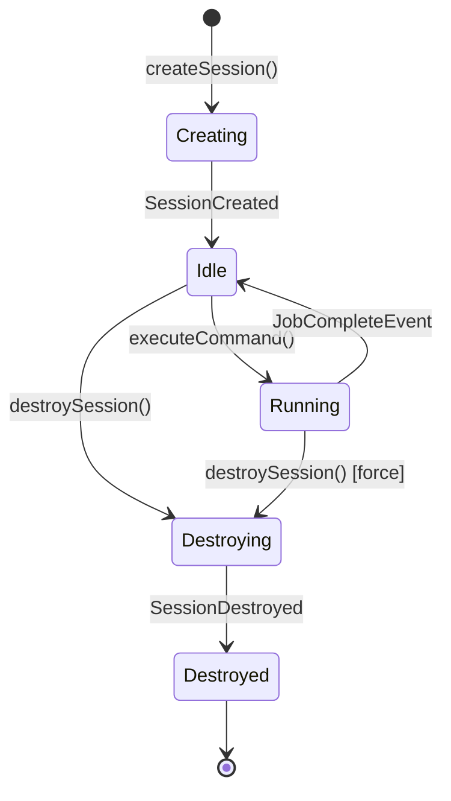

# ADR-002: Session Lifecycle State Machine

**Status:** Accepted
**Date:** 2026-05-07

---

## Context

Sessions are the primary unit of work in K-Wire. A session encapsulates model config, tool registry, and conversation state. The lifecycle must be unambiguous and observable.

---

## Decision

Five-state machine with explicit transitions. No implicit state changes.

---

## States

| State | Meaning | Valid Transitions |
|---|---|---|
| `creating` | Allocation in progress | `idle` |
| `idle` | Ready for commands | `running`, `destroying` |
| `running` | Job executing | `idle` (on completion), `destroying` (force) |
| `destroying` | Teardown in progress | `destroyed` |
| `destroyed` | Resources released | — (terminal) |

---

## Mermaid — State Machine

---

## State Transition Table

| From | Event / Action | To | Side Effects |
|---|---|---|---|
| `creating` | `SessionCreated` emitted | `idle` | Register tools, init model |
| `idle` | `ExecuteToolCommand` received | `running` | Emit `JobStarted` |
| `running` | `JobCompleteEvent` emitted | `idle` | Update turn count, emit `SessionUpdated` |
| `running` | `CancelJobCommand` received | `idle` | Emit `JobCompleteEvent(successful: false)` |
| `idle` | `DestroySessionCommand` received | `destroying` | Emit `SessionDestroyed` |
| `running` | `DestroySessionCommand` received | `destroying` | Cancel active job, then destroy |
| `destroying` | Cleanup complete | `destroyed` | Remove from session map |

---

## Invariant

Every state change MUST emit a `SessionUpdated` event with a full `SessionStateSnapshot`. Consumers must be able to reconstruct state from the event log alone.
