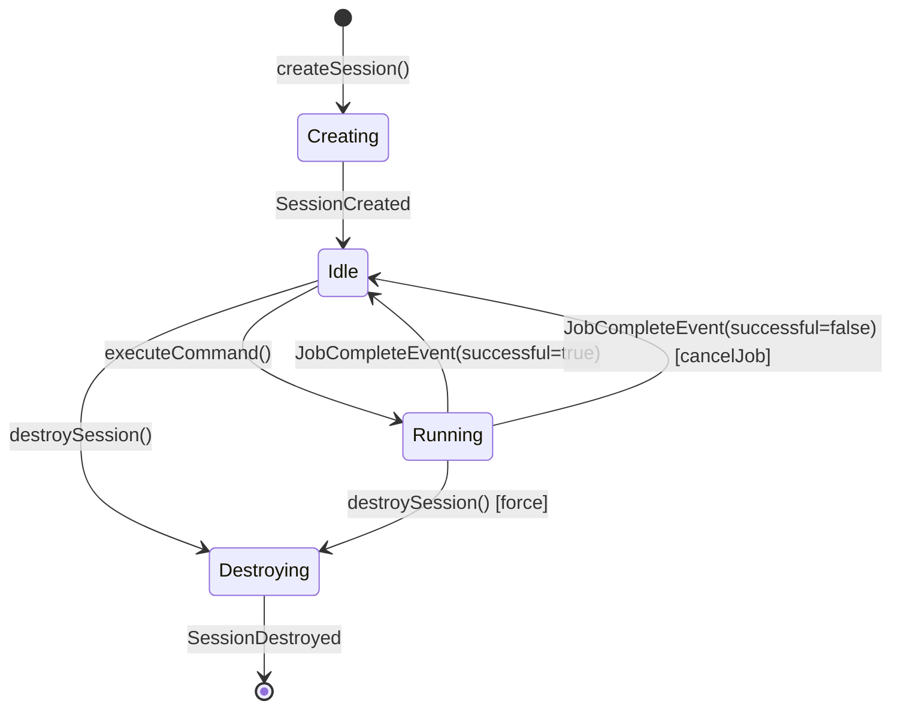

# FRD-001: K-Universe AI Coding Agent Harness

**Version:** 1.0
**Date:** 2026-05-07
**Status:** Active

---

## 1. Purpose

Define the functional requirements for the K-Wire agent harness — the protocol layer, session lifecycle, and tool execution runtime for the K-Universe AI coding agent.

---

## 2. Invariants

1. **Protocol Version Lock** — Every command transmitted over the wire MUST carry `protocolVersion: "1.0"`. Commands missing this field are rejected before dispatch.
2. **Session State Coherence** — `SessionUpdated` events MUST carry a full `SessionStateSnapshot`. Partial or untyped state (`z.any()`) is forbidden. Consumers must be able to reconstruct session state from any snapshot alone.
3. **Job Finality** — Every job that starts MUST emit exactly one `JobCompleteEvent`. Cancellation emits `JobCompleteEvent` with `successful: false`. There is no silent termination.

---

## 3. Subsystem Decomposition

| Subsystem | Responsibility | Key Files |
|---|---|---|
| Protocol | Schemas, branded types, state snapshots | `src/protocol/` |
| AgentCore | Session + job lifecycle orchestration | `src/core/agent.ts` |
| ModelProvider | LLM abstraction (type-only) | `src/core/models.ts` |
| Adapters | Transport bindings (CLI, VS Code, WebSocket) | `src/adapters/` |
| Scripts | Install, scaffold, verify tooling | `scripts/` |

---

## 4. Session State Diagram

---

## 5. Command / Event Matrix

| Command | Emits (success) | Emits (failure) |
|---|---|---|
| `CreateSessionCommand` | `SessionCreated` | — |
| `DestroySessionCommand` | `SessionDestroyed` | — |
| `ExecuteToolCommand` | `JobStarted`, `JobCompleteEvent(successful=true)` | `JobCompleteEvent(successful=false)` |
| `CancelJobCommand` | `JobCompleteEvent(successful=false)` | — |

---

## 6. Acceptance Criteria

- [ ] `SessionUpdated.state` is typed as `SessionStateSnapshot` — no `z.any()`
- [ ] All command schemas include `protocolVersion: z.literal("1.0")`
- [ ] `AgentCore` exposes all 5 methods: `createSession`, `destroySession`, `executeCommand`, `invokeTool`, `cancelJob`
- [ ] `src/core/models.ts` contains zero provider SDK imports
- [ ] `scripts/verify.ts` reports all checks as PASS
- [ ] CLI adapter reads from stdin and writes to stdout as newline-delimited JSON
- [ ] WebSocket adapter handles connection lifecycle
