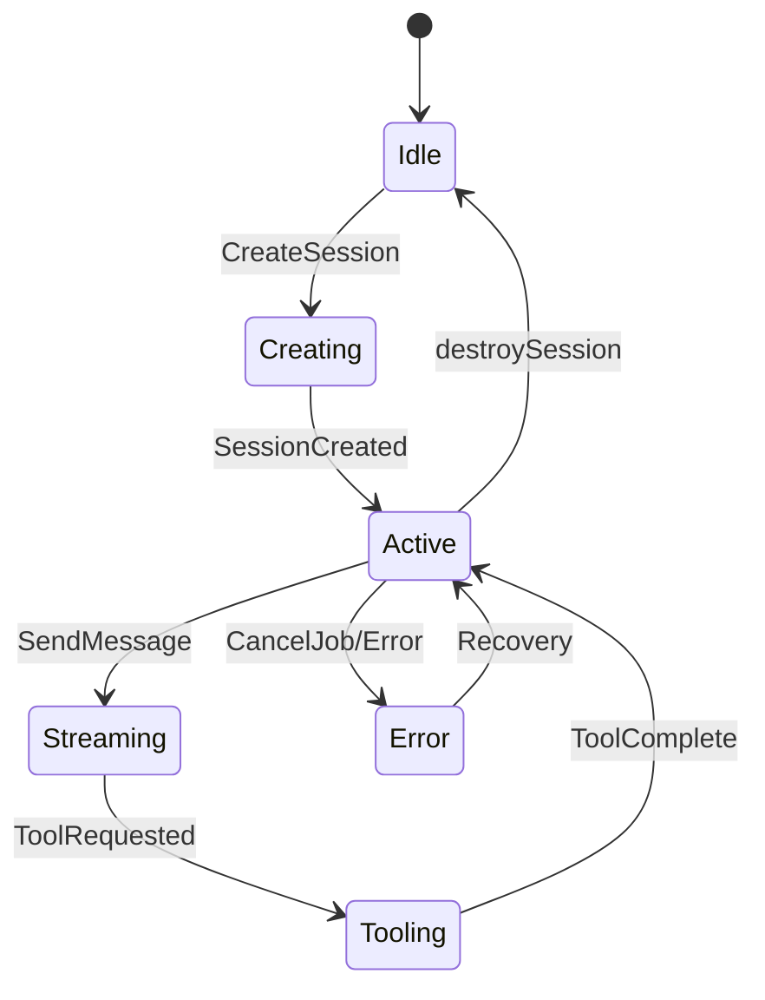
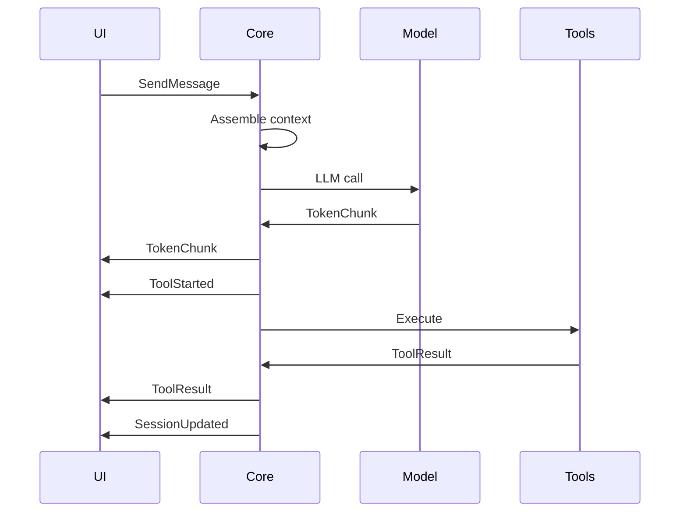
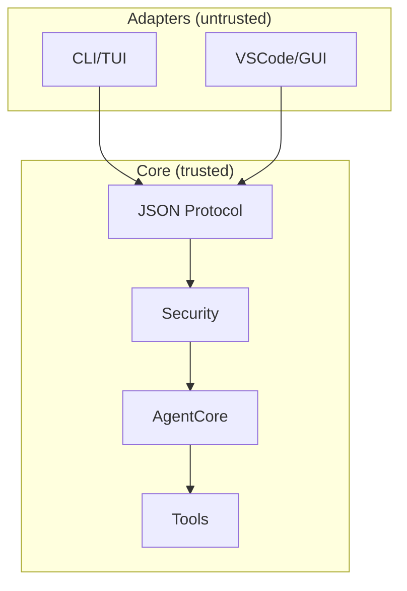

# Summarize the current webpage

Pi is a minimal, highly extensible terminal-based coding agent that you run in a TUI, and then adapt to your own workflows via extensions, skills, prompt templates, themes, and installable packages rather than using a fixed “sealed” product.[pi](https://pi.dev/)

## What Pi is

The page describes Pi as a terminal coding harness focused on being minimal but customizable, with installation via a shell script and a TUI-centric experience started with the `pi` command. It emphasizes that Pi ships with strong defaults but intentionally omits many “opinionated” features so users can build or install exactly what they need instead of adapting to a rigid tool.[pi](https://pi.dev/)

## Customization and extensibility

Pi can be extended with TypeScript-based extensions, skills, prompt templates, and themes, all of which can be bundled into “Pi packages” and shared via npm or git. Extensions can add tools, commands, keybindings, UI elements, custom providers, RAG, long-term memory, and features like sub‑agents, plan mode, permission gates, SSH, sandboxing, and more, with over 50 example extensions linked from the docs.[pi](https://pi.dev/)

## Providers, models, and history

Pi supports 15+ providers and hundreds of models (Anthropic, OpenAI, Google, Azure, Bedrock, Mistral, Groq, Cerebras, xAI, Hugging Face, Kimi For Coding, MiniMax, OpenRouter, Ollama, etc.), with configuration via `models.json` or extensions and model switching via `/model`, `Ctrl+L`, and `Ctrl+P`. Sessions are stored as tree-structured histories you can navigate with `/tree`, bookmark, export to HTML via `/export`, or share as GitHub gists via `/share` with an example session shown.[pi](https://pi.dev/)

## Context engineering features

The page highlights Pi’s minimal system prompt and context-engineering tools: AGENTS.md for project instructions, SYSTEM.md for project-specific system prompts, automatic but extensible compaction of old messages, skills loaded on demand, reusable prompt templates invoked as `/name`, and dynamic context injection via extensions. This setup is designed so users can precisely control what enters the context window, how it is summarized, and how long-term memory or RAG is implemented.[pi](https://pi.dev/)

## Modes and philosophy

Pi exposes four main modes: Interactive (full TUI), Print/JSON (`pi -p "query"` and `--mode json` for scripts and event streams), RPC (JSON protocol over stdin/stdout for non-Node integrations), and SDK (embedding Pi in apps, with OpenClaw as an example). The “primitives, not features” and “What we didn’t build” sections stress that Pi deliberately omits MCP, built‑in sub‑agents, permission popups, plan mode, to‑dos, and background bash, expecting users to implement or install these via extensions, packages, or existing tools like tmux instead.[pi](https://pi.dev/)

Do you want a follow-up focused specifically on how to integrate Pi into your current Tauri/Node toolchain, or a deeper dive into the extension API?

# Four modes Interactive: The full TUI experience. Print/JSON: pi -p "query" for scripts, --mode json for event streams. RPC: JSON protocol over stdin/stdout for non-Node integrations. See docs/rpc.md. SDK: Embed Pi in your apps. See OpenClaw for a real-world example. Show more

Those four lines describe the four ways you can run or embed Pi, each targeting a different integration style.[pi](https://pi.dev/)

## Interactive

Interactive mode is the default full-screen TUI you get when you run `pi` in a terminal. This is where you use Pi as a live coding assistant with its tree history, context tools, keybindings, and all extensions available in the UI.[pi](https://pi.dev/)

## Print/JSON

Print/JSON mode is for scripting and automation, where `pi -p "query"` prints a one-shot answer suitable for shell scripts and `--mode json` emits a structured event stream (tokens, tool calls, etc.) over stdout. This lets you bolt Pi’s reasoning onto existing CLI workflows or parse model output programmatically without using the TUI.[pi](https://pi.dev/)

## RPC

RPC mode exposes Pi via a JSON protocol over stdin/stdout for non-Node integrations, with the protocol documented in `docs/rpc.md`. You run Pi as a subprocess and talk to it using structured JSON messages, which is useful when embedding Pi into tools written in other languages or custom runtimes.[pi](https://pi.dev/)

## SDK

SDK mode means using Pi directly as a library from your application code rather than as a separate process or TUI. The site points to OpenClaw as a real-world example, where Pi is embedded to provide coding-agent behavior inside another app’s UX.[pi](https://pi.dev/)

For your current stack, which mode are you most interested in wiring up first: shell/script (Print/JSON), RPC, or full SDK embed?

# Primitives, not features Features that other agents bake in, you can build yourself. Extensions are TypeScript modules with access to tools, commands, keyboard shortcuts, events, and the full TUI. Sub-agents, plan mode, permission gates, path protection, SSH execution, sandboxing, MCP integration, custom editors, status bars, overlays. Bundle extensions, skills, prompts, and themes as packages. Install from npm or git: $ pi install npm:@foo/pi-tools $ pi install git:github.com/badlogic/pi-doom Browse packages and it can play doom What we didn't build Pi is aggressively extensible so it doesn't have to dictate your workflow. Features that other tools bake in can be built with extensions, skills, or installed from third-party Pi packages. This keeps the core minimal while letting you shape Pi to fit how you work. Read the blog post No MCP Build CLI tools with READMEs (see Skills), or build an extension that adds MCP support. Why? No sub-agents Spawn Pi instances via tmux, or build your own with extensions, or install a package that does it your way. No permission popups Run in a container, or build your own confirmation flow with extensions inline with your environment and security requirements. No plan mode Write plans to files, or build it with extensions, or install a package. No built-in to-dos Use a TODO.md file, or build your own with extensions. No background bash Use tmux. Full observability, direct interaction.Bundle extensions, skills, prompts, and themes as packages. Install from npm or git: $ pi install npm:@foo/pi-tools $ pi install git:github.com/badlogic/pi-doom Browse packages and it can play doom What we didn't build Pi is aggressively extensible so it doesn't have to dictate your workflow. Features that other tools bake in can be built with extensions, skills, or installed from third-party Pi packages. This keeps the core minimal while letting you shape Pi to fit how you work. Read the blog post No MCP Build CLI tools with READMEs (see Skills), or build an extension that adds MCP support. Why? No sub-agents Spawn Pi instances via tmux, or build your own with extensions, or install a package that does it your way. No permission popups Run in a container, or build your own confirmation flow with extensions inline with your environment and security requirements. No plan mode Write plans to files, or build it with extensions, or install a package. No built-in to-dos Use a TODO.md file, or build your own with extensions. No background bash Use tmux. Full observability, direct interaction. Show more

This section explains Pi’s philosophy: instead of shipping lots of built‑in workflows, Pi gives you low-level **primitives** (extensions, skills, packages) so you can assemble exactly the features you want.[pi](https://pi.dev/)

## Primitives, not features

Pi treats things like sub‑agents, plan mode, permission flows, path protection, SSH execution, sandboxing, and even MCP support as optional behaviors implemented via TypeScript extensions that can hook tools, commands, keybindings, events, and the full TUI. The docs link to example extensions for each of these capabilities, showing that they are not special “core” features but just first‑class extension code you can read and modify.[pi](https://pi.dev/)

## Packaging model

You can bundle extensions, skills, prompt templates, and themes into Pi packages, then install them either from npm or arbitrary git repos using `pi install npm:@foo/pi-tools` or `pi install git:github.com/badlogic/pi-doom`. The site provides a package browser and even highlights that someone shipped a Doom-playing package, demonstrating that packages can modify the TUI in fairly extreme ways.[pi](https://pi.dev/)

## “What we didn’t build”

The “What we didn’t build” block lists things Pi deliberately does not include in the core: MCP, sub‑agents, permission popups, plan mode, to‑do systems, and background bash. For each item, it suggests concrete alternatives, like using CLI tools + READMEs as skills, using tmux for multiple agents or background shells, and relying on extensions or packages if you want richer flows such as plan mode or confirmation dialogs.[pi](https://pi.dev/)

## Design intent

Overall, this part of the page is asserting that Pi should not dictate your workflow; instead you keep using tools like tmux, TODO.md, and regular CLIs, and then layer Pi’s extension system on top when you want automation or agent behavior. This keeps the core minimal and predictable while still letting you reach parity with, or exceed, other agents by composing primitives inside your own environment.[pi](https://pi.dev/)

For your own stack, are you more interested in using Pi’s primitives to replicate MCP-style capabilities, or to build a tightly integrated, custom coding harness around your existing tmux/TUI workflow?

# what is the difference of core opencode TUI (terminal GUI) and pi agent TUI (terminal GUI) and

Core opencode TUIs are generic terminal UIs you build for arbitrary workflows, while the Pi coding agent TUI is a prebuilt, model-centric coding harness whose core is intentionally minimal and extended almost entirely through TypeScript extensions, skills, and packages.[pi](https://pi.dev/)

## Core TUI vs Pi agent TUI: role

A “core” TUI (like a custom opencode terminal GUI) is typically an application UI layer around your own business logic or tools: panes, keybindings, views, maybe some task orchestration, but no baked-in LLM semantics. It is usually responsible for rendering, input, navigation, and dispatching to whatever backend logic or CLIs you define, with any “agent” behavior being handcrafted or external.[pi](https://pi.dev/)

Pi’s TUI, in contrast, is specifically a coding agent harness: the UI is tightly coupled to sessions, trees of messages, models, tools, and context management, and all interaction is centered around driving an LLM plus tools to operate on your filesystem, repos, and CLIs.[pi](https://pi.dev/)

## Extensibility model

In a typical core TUI, extensibility is “app-specific”: you add more views, commands, or panels by editing the app itself or implementing plugins in whatever language the TUI is written in. You usually own the entire event loop and input map, so extension points are ad hoc.

Pi’s TUI exposes a defined extension API: extensions are TypeScript modules with access to tools, commands, keyboard shortcuts, events, and the entire TUI surface, letting you add things like sub-agents, plan mode, permission gates, SSH, sandboxing, custom editors, overlays, and status bars purely as extensions. These can then be bundled with skills, prompt templates, and themes into Pi packages and installed via npm or git.[pi](https://pi.dev/)

## Built-ins vs “primitives only”

A core TUI often bakes in features: task lists, panes, dashboards, background jobs, or whatever domain-specific flows you designed, and users mostly _adapt to_ that opinionated workflow. Changing behavior often means modifying core code or relying on limited plugin hooks.

Pi’s philosophy is “primitives, not features”: the core intentionally does **not** ship MCP, sub-agents, permission popups, plan mode, built-in to-dos, or background bash. Instead, it gives primitives (skills, tools, extensions, session tree, minimal system prompt, AGENTS.md, SYSTEM.md, dynamic context hooks) and expects you to implement or install your preferred version of these flows as packages.[pi](https://pi.dev/)

## Workflow integration

A core TUI is usually the center of the workflow itself, e.g., a dashboard or IDE-like app; external tools are integrations but not the primary abstraction. The TUI is an end-product.

Pi assumes your existing workflow stays in plain tools: tmux for sessions, TODO.md for tasks, CLIs with READMEs as skills, and normal shells for background work. The Pi TUI sits as an agent harness on top, manipulating those tools by calling skills, running commands, and editing files, so the “product” is more like a programmable control plane than a monolithic app.[pi](https://pi.dev/)

## Modes and embedding

A generic TUI may or may not expose programmatic interfaces; often it’s just an interactive app. If it does, RPC or plugin APIs tend to be bespoke.

Pi’s TUI is one of four standardized modes: interactive (TUI), Print/JSON for scripts, RPC over stdin/stdout, and SDK embedding in other apps. This means you can treat Pi’s TUI as just one view on the same underlying coding agent engine that you can also drive as a process (RPC) or library (SDK) from your own TUIs or GUIs.[pi](https://pi.dev/)

<table class="[&amp;_tr:last-child_td]:border-b-0 my-0 w-full table-auto border-separate border-spacing-0 text-sm font-sans rounded-lg [&amp;_tr:last-child_td:first-child]:rounded-bl-lg [&amp;_tr:last-child_td:last-child]:rounded-br-lg"><thead><tr><th scope="col" class="border-subtlest p-sm min-w-[48px] break-normal border-b text-left align-bottom border-r last:border-r-0 font-bold bg-subtle first:border-radius-tl-lg last:border-radius-tr-lg">Aspect</th><th scope="col" class="border-subtlest p-sm min-w-[48px] break-normal border-b text-left align-bottom border-r last:border-r-0 font-bold bg-subtle first:border-radius-tl-lg last:border-radius-tr-lg">Core opencode TUI (generic)</th><th scope="col" class="border-subtlest p-sm min-w-[48px] break-normal border-b text-left align-bottom border-r last:border-r-0 font-bold bg-subtle first:border-radius-tl-lg last:border-radius-tr-lg">Pi coding agent TUI</th></tr></thead><tbody><tr><td class="border-subtlest px-sm min-w-[48px] break-normal border-b border-r last:border-r-0">Primary purpose</td><td class="border-subtlest px-sm min-w-[48px] break-normal border-b border-r last:border-r-0">General terminal UI around arbitrary tools</td><td class="border-subtlest px-sm min-w-[48px] break-normal border-b border-r last:border-r-0">Coding agent harness around LLM + tools <span class="citation-nbsp"></span><span class="inline-flex" aria-label="Pi Coding Agent" data-state="closed"><span class="citation inline"><a rel="noopener" class="inline-flex max-w-full min-w-0" target="_blank" href="https://pi.dev/"><span class="relative -mt-px max-w-full min-w-0 whitespace-nowrap -top-px font-sans text-base text-foreground select-none selection:bg-super/50 selection:text-foreground dark:selection:bg-super/10 dark:selection:text-super"><span class="text-3xs rounded-badge group min-w-4 max-w-full cursor-pointer text-center align-middle font-mono tabular-nums font-normal transition-colors duration-150 inline-flex items-center py-[0.1875rem] leading-snug px-[0.3rem] [@media(hover:hover)]:hover:bg-subtle group-data-[state=open]/trigger:bg-subtle border-subtlest ring-subtlest divide-subtlest bg-quiet"><span class="inline-block relative !mt-0 ![vertical-align:unset] max-w-[25ch] overflow-hidden">pi</span></span></span></a></span></span></td></tr><tr><td class="border-subtlest px-sm min-w-[48px] break-normal border-b border-r last:border-r-0">Feature model</td><td class="border-subtlest px-sm min-w-[48px] break-normal border-b border-r last:border-r-0">Features baked into app or plugins</td><td class="border-subtlest px-sm min-w-[48px] break-normal border-b border-r last:border-r-0">Minimal core, features via extensions/skills/packages <span class="citation-nbsp"></span><span class="inline-flex" aria-label="Pi Coding Agent" data-state="closed"><span class="citation inline"><a rel="noopener" class="inline-flex max-w-full min-w-0" target="_blank" href="https://pi.dev/"><span class="relative -mt-px max-w-full min-w-0 whitespace-nowrap -top-px font-sans text-base text-foreground select-none selection:bg-super/50 selection:text-foreground dark:selection:bg-super/10 dark:selection:text-super"><span class="text-3xs rounded-badge group min-w-4 max-w-full cursor-pointer text-center align-middle font-mono tabular-nums font-normal transition-colors duration-150 inline-flex items-center py-[0.1875rem] leading-snug px-[0.3rem] [@media(hover:hover)]:hover:bg-subtle group-data-[state=open]/trigger:bg-subtle border-subtlest ring-subtlest divide-subtlest bg-quiet"><span class="inline-block relative !mt-0 ![vertical-align:unset] max-w-[25ch] overflow-hidden">pi</span></span></span></a></span></span></td></tr><tr><td class="border-subtlest px-sm min-w-[48px] break-normal border-b border-r last:border-r-0">Extensibility</td><td class="border-subtlest px-sm min-w-[48px] break-normal border-b border-r last:border-r-0">App-specific, language-dependent</td><td class="border-subtlest px-sm min-w-[48px] break-normal border-b border-r last:border-r-0">TypeScript extensions with full TUI access <span class="citation-nbsp"></span><span class="inline-flex" aria-label="Pi Coding Agent" data-state="closed"><span class="citation inline"><a rel="noopener" class="inline-flex max-w-full min-w-0" target="_blank" href="https://pi.dev/"><span class="relative -mt-px max-w-full min-w-0 whitespace-nowrap -top-px font-sans text-base text-foreground select-none selection:bg-super/50 selection:text-foreground dark:selection:bg-super/10 dark:selection:text-super"><span class="text-3xs rounded-badge group min-w-4 max-w-full cursor-pointer text-center align-middle font-mono tabular-nums font-normal transition-colors duration-150 inline-flex items-center py-[0.1875rem] leading-snug px-[0.3rem] [@media(hover:hover)]:hover:bg-subtle group-data-[state=open]/trigger:bg-subtle border-subtlest ring-subtlest divide-subtlest bg-quiet"><span class="inline-block relative !mt-0 ![vertical-align:unset] max-w-[25ch] overflow-hidden">pi</span></span></span></a></span></span></td></tr><tr><td class="border-subtlest px-sm min-w-[48px] break-normal border-b border-r last:border-r-0">Agent semantics</td><td class="border-subtlest px-sm min-w-[48px] break-normal border-b border-r last:border-r-0">Optional/custom, not inherent</td><td class="border-subtlest px-sm min-w-[48px] break-normal border-b border-r last:border-r-0">First-class (sessions, tools, context, models) <span class="citation-nbsp"></span><span class="inline-flex" aria-label="Pi Coding Agent" data-state="closed"><span class="citation inline"><a rel="noopener" class="inline-flex max-w-full min-w-0" target="_blank" href="https://pi.dev/"><span class="relative -mt-px max-w-full min-w-0 whitespace-nowrap -top-px font-sans text-base text-foreground select-none selection:bg-super/50 selection:text-foreground dark:selection:bg-super/10 dark:selection:text-super"><span class="text-3xs rounded-badge group min-w-4 max-w-full cursor-pointer text-center align-middle font-mono tabular-nums font-normal transition-colors duration-150 inline-flex items-center py-[0.1875rem] leading-snug px-[0.3rem] [@media(hover:hover)]:hover:bg-subtle group-data-[state=open]/trigger:bg-subtle border-subtlest ring-subtlest divide-subtlest bg-quiet"><span class="inline-block relative !mt-0 ![vertical-align:unset] max-w-[25ch] overflow-hidden">pi</span></span></span></a></span></span></td></tr><tr><td class="border-subtlest px-sm min-w-[48px] break-normal border-b border-r last:border-r-0">Workflow stance</td><td class="border-subtlest px-sm min-w-[48px] break-normal border-b border-r last:border-r-0">Users adapt to app’s built-ins</td><td class="border-subtlest px-sm min-w-[48px] break-normal border-b border-r last:border-r-0">Pi adapts to existing tmux/CLI/TODO workflows <span class="citation-nbsp"></span><span class="inline-flex" aria-label="Pi Coding Agent" data-state="closed"><span class="citation inline"><a rel="noopener" class="inline-flex max-w-full min-w-0" target="_blank" href="https://pi.dev/"><span class="relative -mt-px max-w-full min-w-0 whitespace-nowrap -top-px font-sans text-base text-foreground select-none selection:bg-super/50 selection:text-foreground dark:selection:bg-super/10 dark:selection:text-super"><span class="text-3xs rounded-badge group min-w-4 max-w-full cursor-pointer text-center align-middle font-mono tabular-nums font-normal transition-colors duration-150 inline-flex items-center py-[0.1875rem] leading-snug px-[0.3rem] [@media(hover:hover)]:hover:bg-subtle group-data-[state=open]/trigger:bg-subtle border-subtlest ring-subtlest divide-subtlest bg-quiet"><span class="inline-block relative !mt-0 ![vertical-align:unset] max-w-[25ch] overflow-hidden">pi</span></span></span></a></span></span></td></tr><tr><td class="border-subtlest px-sm min-w-[48px] break-normal border-b border-r last:border-r-0">Integration modes</td><td class="border-subtlest px-sm min-w-[48px] break-normal border-b border-r last:border-r-0">Usually interactive only, maybe custom APIs</td><td class="border-subtlest px-sm min-w-[48px] break-normal border-b border-r last:border-r-0">TUI, Print/JSON, RPC, SDK <span class="citation-nbsp"></span><span class="inline-flex" aria-label="Pi Coding Agent" data-state="closed"><span class="citation inline"><a rel="noopener" class="inline-flex max-w-full min-w-0" target="_blank" href="https://pi.dev/"><span class="relative -mt-px max-w-full min-w-0 whitespace-nowrap -top-px font-sans text-base text-foreground select-none selection:bg-super/50 selection:text-foreground dark:selection:bg-super/10 dark:selection:text-super"><span class="text-3xs rounded-badge group min-w-4 max-w-full cursor-pointer text-center align-middle font-mono tabular-nums font-normal transition-colors duration-150 inline-flex items-center py-[0.1875rem] leading-snug px-[0.3rem] [@media(hover:hover)]:hover:bg-subtle group-data-[state=open]/trigger:bg-subtle border-subtlest ring-subtlest divide-subtlest bg-quiet"><span class="inline-block relative !mt-0 ![vertical-align:unset] max-w-[25ch] overflow-hidden">pi</span></span></span></a></span></span></td></tr><tr><td class="border-subtlest px-sm min-w-[48px] break-normal border-b border-r last:border-r-0">Installed features</td><td class="border-subtlest px-sm min-w-[48px] break-normal border-b border-r last:border-r-0">Fixed by app, plus plugins</td><td class="border-subtlest px-sm min-w-[48px] break-normal border-b border-r last:border-r-0">Installable Pi packages from npm/git (e.g., Doom, termDRAW) <span class="citation-nbsp"></span><span class="inline-flex" aria-label="Pi Coding Agent" data-state="closed"><span class="citation inline"><a rel="noopener" class="inline-flex max-w-full min-w-0" target="_blank" href="https://pi.dev/"><span class="relative -mt-px max-w-full min-w-0 whitespace-nowrap -top-px font-sans text-base text-foreground select-none selection:bg-super/50 selection:text-foreground dark:selection:bg-super/10 dark:selection:text-super"><span class="text-3xs rounded-badge group min-w-4 max-w-full cursor-pointer text-center align-middle font-mono tabular-nums font-normal transition-colors duration-150 inline-flex items-center py-[0.1875rem] leading-snug px-[0.3rem] [@media(hover:hover)]:hover:bg-subtle group-data-[state=open]/trigger:bg-subtle border-subtlest ring-subtlest divide-subtlest bg-quiet"><span class="inline-block relative !mt-0 ![vertical-align:unset] max-w-[25ch] overflow-hidden">pi</span></span></span></a></span></span></td></tr></tbody></table>

For your use case, are you thinking of treating Pi as the _primary_ TUI and retiring some of your core opencode TUIs, or embedding Pi (RPC/SDK) _into_ a TUI you already control?

# How to code using ai + FRD + almost no human interaction (just to build the tool)? Possible? yes or no? How long? how many files (less possible is better) to get something going competing with pi agent x opencode x openclaude Show more

Yes, it is possible in principle to code such a tool with AI + FRD and minimal human interaction, but in practice you will still need tight human steering for architecture, guardrails, and debugging if you want to compete with Pi/OpenClaw‑class agents.[pi](https://pi.dev/)

## Feasibility (yes/no) and constraints

You can absolutely use AI to drive most of the coding, with you mainly writing the functional requirements (FRD), curating prompts, and doing reviews instead of hand-writing every line. Modern agents (including Pi itself) are already used to auto-generate extensions, skills, and packages, and its docs explicitly encourage “have Pi manipulate itself in place” as a workflow, which is the same pattern you want to follow for your own harness. The hard parts are not code generation, but: designing the primitives (sessions, tools, skills), defining security and filesystem policies, and iterating on UX, all of which require human decisions even if AI writes the implementation.[pi](https://pi.dev/)

## Time to first viable prototype

If you scope to “Pi‑lite” rather than full parity, you can get something minimally competitive in days, not months, assuming you let AI do heavy lifting and you stay in a stack you already know (TypeScript/Node or Rust/Tauri). A reasonable path to “usable coding agent harness” is roughly: 1–2 days for a REPL/TUI skeleton with model calls and file ops, 2–4 days for basic session history + tree or branch support, and another 3–7 days for skills/tools integration and some context-engineering primitives (FRD-driven, AI-implemented). Reaching Pi’s ecosystem depth (multiple providers, models.json, packages, advanced extensions like SSH, sandbox, termDRAW-style UI customizations) would push you into weeks to months even with AI, simply because there is a lot of surface area.[pi](https://pi.dev/)

So: yes, it is possible; “MVP that feels like a real coding harness” is on the order of one to two weeks of focused work, assuming strong FRDs and heavy AI automation, while “serious competitor to Pi + OpenClaw + your opencode stack” is multiple iterations beyond that.[pi](https://pi.dev/)

## How many files (minimal architecture)

You can get a basic but non-trivial harness into surprisingly few files if you design around composable modules and let AI keep them small:

*   1 file: entrypoint / CLI (argument parsing, mode selection: interactive vs print/JSON).
    
*   1 file: core agent/session loop (message tree, system prompt, context assembly, provider abstraction).
    
*   1 file: model provider client (wrapping one or two LLM APIs).
    
*   1–2 files: tools/skills registry + a couple of built-in tools (fs read/write, run command).
    
*   1 file: FRD-driven TUI layer or REPL (if you accept a simpler UI than Pi’s full TUI).
    
*   1 file: config/model registry (like a minimal models.json equivalent).
    
*   Optional 1–2 files: plugin/extension loader and one example extension.
    

With careful design, you could get a working harness into ~6–10 source files initially, then let AI grow it as needed. Pi itself exposes many advanced features (tree sessions, AGENTS.md/SYSTEM.md support, compaction, dynamic context, extensions system, packages, etc.), which are spread across more files in its repo, but your first iteration doesn’t need that full surface.[pi](https://pi.dev/)

## Competing with Pi / opencode / OpenClaw

To “compete” with Pi and OpenClaw you do not need to replicate every feature; you need a clear, minimal, opinionated core that matches your own workflow better than theirs. A lean architecture could be:[pi](https://pi.dev/)

*   A single agent loop with FRD-specified context pipeline (system prompt, project docs, last N messages, tool outputs).
    
*   A tiny skill/tool interface that is just “name + description + function(args) -> result”.
    
*   A simple “extensions” directory where each extension is one TypeScript/JS module that registers tools and possibly UI tweaks.
    
*   A basic TUI or REPL with streaming and a side panel for files/tasks.
    

AI can generate all of this, but you should be the one writing the FRDs for each layer: core loop, tool interface, extension API, TUI layout. Pi shows that the real differentiator is not raw features but primitives: minimal core, extensions, skills, prompt templates, and themes, plus package installation. You can define a slimmer version of those primitives in a handful of files and let AI fill in the details.[pi](https://pi.dev/)

If you want, I can draft a concrete FRD plus file layout (e.g., 8 files max) for a “Pi‑style coding harness MVP” that you can hand directly to an AI coding agent to implement. To calibrate scope, would you rather target a Node/TypeScript CLI/TUI first or go straight for a Tauri/Rust desktop harness as v1?

# It needs to be competing vs real tools tui stack

To compete with “real tools TUI stacks” (Pi, OpenClaw, serious opencode setups), your harness needs to be opinionated about developer workflows, not just “an LLM in a terminal.”[pi](https://pi.dev/)

## What “competing” actually requires

A competitive TUI stack is a full coding harness: it must orchestrate models, tools, files, terminals, and history in a way that reliably saves the user time compared to bare tmux + shell. Pi explicitly positions itself as a minimal but extensible coding harness with tree sessions, context engineering, skills, extensions, packages, and multi-provider support; matching that _class_ means offering similar primitives, even if you don’t copy every feature. The TUI has to feel like a “home base” for work: quick navigation, good defaults, and no fighting the tool to do basic dev tasks.[pi](https://pi.dev/)

## Pi’s bar for a serious TUI

Pi’s bar includes: a robust TUI focused on sessions and tools, a minimal but carefully designed system prompt, AGENTS.md and SYSTEM.md for project-level steering, automatic but extensible compaction, dynamic context injection, and an extension API that can add things like SSH, sandboxing, overlays, and custom editors. It also supports 15+ providers and hundreds of models, with model switching, model registries (models.json), and multiple modes (interactive, Print/JSON, RPC, SDK) to integrate into different stacks. On top of that, it has a packages ecosystem (npm/git) so people can share and install real functionality like termDRAW or Doom.[pi](https://pi.dev/)

## What your competing stack must include (minimum)

To be taken seriously beside Pi and similar tools, your stack should, at minimum, provide:

1.  **Session + history model**: persistent, tree-structured or at least branchable sessions, with cheap navigation and export/sharing mechanisms.[pi](https://pi.dev/)
    
2.  **Context engineering surface**: project docs equivalents (AGENTS.md/SYSTEM.md), prompt templates, dynamic context hooks, and configurable compaction strategies.[pi](https://pi.dev/)
    
3.  **Tool/skill system**: a stable interface for tools (fs, shell, VCS, HTTP, etc.), with documentation-like READMEs or FRDs the model can rely on, similar to Pi’s skills.[pi](https://pi.dev/)
    
4.  **Extension/plugin story**: a way to extend tools, commands, keybindings, and UI pieces without forking the core harness, akin to Pi’s TypeScript extensions and packages.[pi](https://pi.dev/)
    
5.  **Multi-mode integration**: TUI for humans, plus at least one programmatic mode (Print/JSON or RPC) so the harness is composable inside other systems, like Pi’s modes.[pi](https://pi.dev/)
    

If you hit those, you’re in the same _tier_ as Pi/OpenClaw, even if you intentionally keep the feature count lower.

## Where you can differentiate

You don’t have to mirror Pi’s philosophy; you can compete by optimizing for:

*   **Tighter flow with your existing tools**: e.g., first-class tmux integration, Playwright/Puppeteer workflows, or Tauri builds wired directly into the agent.
    
*   **More opinionated FRD-first development**: make “write FRD, let agent implement, inspect diff” the primary workflow, with UI affordances specialized for that loop.
    
*   **Better safety/observability**: more explicit path protection, permission gates, and sandboxing policies than Pi’s “use tmux, use containers, or build it yourself” stance.[pi](https://pi.dev/)
    

Pi’s “primitives, not features” angle leaves room for a tool that ships a more batteries-included, “batteries but replaceable” harness if you want to.[pi](https://pi.dev/)

## Short answer for your direction

If your goal is to compete with Pi-class TUIs, design your harness around a small set of strong primitives (sessions, tools, context, extensions, modes) and treat AI as the engine that fills in implementation details, not the designer. With that mindset, you can absolutely build a credible competitor; the real work is getting the primitives and UX right, not the raw code volume.[pi](https://pi.dev/)

Would you like me to draft a concrete, Pi-level “competitive” feature/primitives checklist that we treat as the FRD baseline for v1 of your harness?

# what if I don't like the Terminal aesthetic look GUI/Terminal frontend user interface? You have a smart \*\*applicable-strategy\*\* for no flop.. no ai bullshit, bad codes, spaghetti codes, unsellable trash, lazy bad code quality. I mean human like if not better strategy than any expert out there. > "To have a so well structured outlined codebase from the start (with intents to not like the ui .. > needing to revamp all the look while not breaking the functionality, core, fundamental's codes)" >>> I can explain more if you'd like but let's save some time, money, assure quality, assurance, secure, unbeatable solutions... no guessing make 5 round of research if you have too.. for 1-2 final frd's ? Show more

You avoid “terminal aesthetic lock‑in” by designing a **headless agent core with swappable UI adapters** from day one, and by making your FRDs describe behaviors and data contracts, not specific UI look or layout.[pi](https://pi.dev/)

## Core strategy in one line

Treat the TUI as an optional client on top of a **UI‑agnostic agent engine** (service or library) that exposes a stable, typed protocol (JSON/RPC/HTTP) for: sessions, tools, context, and streaming events. If you later hate the terminal UI, you throw away the TUI adapter and build a new React/Tauri UI that talks to the same engine without touching the core code.[pi](https://pi.dev/)

Pi already hints at this: it exposes Interactive (TUI), Print/JSON, RPC, and SDK modes over the same core primitives, which is exactly the pattern you want to follow.[pi](https://pi.dev/)

* * *

## Architectural principles (no-flop, revamp‑proof)

Design rules so your base is revamp‑proof even if v1 UI is ugly or completely changes:

1.  **Headless “Agent Core”**  
    The core knows about: sessions, message trees, tools/skills, models, AGENTS/SYSTEM docs, context assembly, compaction, and long‑running jobs. It does **not** know about terminal colors, box drawing characters, React components, CSS, or TUI widget layout. All user interaction flows in as typed commands/events and out as typed state diffs/streams.[pi](https://pi.dev/)
    
2.  **UI as adapter, not owner of logic**  
    The UI adapter (TUI now, GUI later) is responsible only for: rendering state, capturing user input, and forwarding it as commands to the core. It must not implement business logic like “how tools are sequenced”, “how context is built”, or “when to compact messages”. Those belong in the core, so you can re-skin endlessly without behavior drift.[pi](https://pi.dev/)
    
3.  **Stable protocol first, aesthetic second**  
    Define an explicit protocol between UI and core:
    
    *   Commands: `CreateSession`, `SendMessage`, `RunTool`, `SelectModel`, `ApplyEdit`, etc.
        
    *   Events: `TokenChunk`, `ToolStarted`, `ToolResult`, `SessionUpdated`, `Error`, etc.
        
    *   State snapshots: session tree, current message, tool inventory, current plan, etc.
        
    
    This protocol is your “UI contract”; if you preserve it, UIs are swappable. This is exactly how Pi’s RPC and SDK modes open the same agent semantics to different frontends.[pi](https://pi.dev/)
    
4.  **Pure state model for view**  
    The core exposes “view models” as pure JSON (no rendering concerns): what panes exist, what lists they show, what prompts, what progress indicators, etc. The UI translates that into ncurses‑style widgets today, and into Tailwind + React components tomorrow, with **zero changes** to the core.
    
5.  **Theming and layout as data**  
    Even for the TUI, push as much of “look” into config: theme tokens, keybinding maps, layout presets described as JSON/YAML. The adapter uses those tokens to render; core only tags elements (“primary panel”, “sidebar”, “status line”) without knowing how they’re drawn.
    

* * *

## FRD #1 – Agent Core Service (UI‑agnostic)

This is the main FRD you give to an AI coding agent; it defines the engine that must **not** care what the UI looks like.

**Purpose**

*   Provide a headless coding agent engine that orchestrates LLMs, tools/skills, sessions, and context pipelines.
    
*   Expose a stable protocol that multiple frontends (TUI, GUI, web, RPC clients) can use concurrently.
    

**Key capabilities**

*   Session management with tree or branch support (similar to Pi’s session tree).[pi](https://pi.dev/)
    
*   Tools/skills registry with metadata and READMEs, like Pi’s skills.[pi](https://pi.dev/)
    
*   Context pipeline: system prompt, project docs (AGENTS/SYSTEM equivalents), recent messages, tool outputs, optional RAG.[pi](https://pi.dev/)
    
*   Model abstraction over at least one provider, with the ability to add more later (like Pi’s multi‑provider support via models.json).[pi](https://pi.dev/)
    
*   Streaming events: token streams, tool call lifecycle, status/progress updates.
    

**Functional requirements (high level)**

*   `CreateSession(projectId?, initialPrompt?) -> SessionDescriptor`
    
*   `ListSessions(projectId?) -> SessionDescriptor[]`
    
*   `SendMessage(sessionId, content, options) -> stream<Event>`
    
*   `ApplyToolResult(sessionId, toolInvocationId, result) -> SessionUpdate`
    
*   `ListTools() -> ToolDescriptor[]`
    
*   `InvokeToolDirect(toolName, args) -> ToolResult`
    
*   `GetSessionState(sessionId) -> SessionStateSnapshot`
    
*   `ConfigureProject(projectId, configPayload) -> ProjectConfig`
    

**Non‑functional requirements**

*   Language: your choice (TypeScript/Node or Rust), but API boundary is **typed JSON** so UIs can be any stack.
    
*   Testability: engine functions testable in isolation with no TUI; contract tests for protocol.
    
*   Performance: capable of streaming tokens and events in real time without blocking other sessions.
    
*   Security: path protection and allowed tool operations defined at core level (policy object), not hard‑coded in UI; mirrors Pi’s path protection and sandboxing via extensions.[pi](https://pi.dev/)
    

This FRD produces a single library or local service binary. Everything else (TUI, GUI, RPC) is an adapter.

* * *

## FRD #2 – UI Adapter Layer (first TUI, later GUI)

Second FRD is for the “Frontends” layer: first implementation is TUI; later you plug a GUI onto the same protocol.

**Purpose**

*   Provide one or more frontends (TUI, GUI) that connect to the Agent Core, translating user input into commands and core events into interactive views.
    

**Key concepts**

*   **Transport**:
    
    *   v1: in‑process call or local stdin/stdout JSON RPC (matching what Pi uses for RPC).[pi](https://pi.dev/)
        
    *   v2: WebSocket/HTTP for remote GUIs or Tauri.
        
*   **View model mapping**:
    
    *   Read `SessionStateSnapshot` and render: messages, tree, active tools, errors.
        
    *   Render tool inventory and keybindings from `ToolDescriptor[]`.
        
    *   Display streaming `Event`s: token stream as scrolling text, tool progress in status bar, etc.
        
*   **No business logic**:
    
    *   TUI must not decide when to summarize, which files to include, or how to sequence tools; it only forwards user intent (e.g., “run plan tool”) as commands.
        

**TUI FRD slice**

*   Minimal panes:
    
    *   Main chat/messages pane.
        
    *   Side panel for session list / files / tools.
        
    *   Status line (model name, tool running, path protection status).
        
*   Input line with keybindings for:
    
    *   Send message, cancel, open tool palette, switch session, open config.
        
*   All styling (colors, borders, icons) in a theme config file; adapter just loads theme tokens and applies them.
    

**GUI FRD slice (for later)**

*   React/Tauri app that consumes the **same protocol** and view models:
    
    *   Each core view model type maps to a React component tree.
        
    *   Theming via design tokens; layout defined in config, not compiled into core.
        

Because both TUI and GUI talk to the core via the same protocol, replacing the entire UI is just “build another adapter”.

* * *

## AI + FRD workflow for high‑quality code

To avoid “AI spaghetti trash”, you hard‑gate the process with FRDs and strict boundaries:

1.  **Write FRDs first (you, not the model)**  
    Draft FRD #1 (Agent Core) and FRD #2 (UI Adapters) at this level of precision. These documents define modules, data structures, and API signatures; AI is not allowed to change boundaries without your sign‑off.
    
2.  **Scaffold by layer, not feature**
    
    *   Round 1 with AI: generate minimal project structure and type signatures **only** (no heavy logic).
        
    *   Round 2: implement core behaviors in the engine (sessions, tools, protocol), with tests.
        
    *   Round 3: implement TUI adapter mapping protocol <-> widgets.  
        This prevents “UI logic leaking into core” because you never ask the AI to “just make it work end‑to‑end in one go”.
        
3.  **Enforce contracts with tests and linting**
    
    *   Contract tests: spin a fake UI client that sends protocol commands and asserts on engine responses.
        
    *   Unit tests for session tree, context assembly, tool lifecycle.
        
    *   Lint and formatter mandatory; no AI code merged without passing.
        
4.  **Review boundaries, not every line**  
    Human review focuses on:
    
    *   Did any UI code import engine internals that should be behind protocol?
        
    *   Did any engine component import TUI widgets or platform‑specific code?
        
    *   Are path protection and security policies centralised?
        
5.  **Iterate UI experimentally without touching core**  
    Once core is stable, you allow yourself or AI to completely rework the TUI look (different library, different layout), but you forbid changes to the protocol or engine modules unless backed by FRD updates. That’s your guarantee that “I hate this UI” never forces an engine rewrite.
    

* * *

If you want, next step I can do is write **concrete, copy‑paste‑ready FRD #1 and FRD #2 outlines** (section headings + bullet details) that you can feed directly to a coding agent to start scaffolding the repo, with explicit protocol types and a minimal file layout.

# Fix exactly 3 issues in the code you just generated. No other changes. Output only the changed files. FIX 1 — events.ts Replace z.any() in SessionUpdated Zod schema with SessionStateSnapshotSchema imported from ./state.js FIX 2 — agent.ts Add to AgentCore interface: destroySession(sessionId: SessionId): Promise<void> cancelJob(jobId: JobId): Promise<void> Change invokeTool return type to: Promise<{ jobId: JobId }> FIX 3 — commands.ts Add protocolVersion: z.literal("1.0") to BaseCommand interface and all Zod command schemas. Output: only the 3 patched files. No explanation. Show more

/src/protocol/commands.ts

ts

```
import { z } from "zod";
import {
  SessionId,
  ProjectId,
  ToolName,
  ModelId,
  EditId,
  JobId,
} from "./state.js";

/**
 * Invariant: Every command must carry a 'type' literal for safe discriminated union narrowing.
 */
export type Command =
  | CreateSessionCommand
  | ListSessionsCommand
  | GetSessionStateCommand
  | SendMessageCommand
  | RunToolCommand
  | SelectModelCommand
  | ApplyEditCommand
  | CancelJobCommand;

/**
 * Invariant: Command payloads must be serializable to JSON without loss of information.
 */
export interface BaseCommand {
  /** Invariant: Unique client-generated ID for correlation; must be opaque to core logic. */
  commandId: string;
  /** Invariant: Protocol version for schema compatibility; must be "1.0" for this revision. */
  protocolVersion: "1.0";
}

/**
 * Invariant: Creates a new session; core must return a SessionDescriptor via SessionUpdated event or API.
 */
export interface CreateSessionCommand extends BaseCommand {
  type: "CreateSession";
  projectId?: ProjectId | null;
  initialPrompt?: string | null;
}

/**
 * Invariant: Lists sessions filtered by optional project; must not mutate any core state.
 */
export interface ListSessionsCommand extends BaseCommand {
  type: "ListSessions";
  projectId?: ProjectId | null;
}

/**
 * Invariant: Requests current snapshot; must be a pure read and not trigger side effects.
 */
export interface GetSessionStateCommand extends BaseCommand {
  type: "GetSessionState";
  sessionId: SessionId;
}

/**
 * Invariant: Sends a user message into an existing session and may start jobs/tools/LLM calls.
 */
export interface SendMessageCommand extends BaseCommand {
  type: "SendMessage";
  sessionId: SessionId;
  content: string;
  modelId?: ModelId | null;
  metadata?: Record<string, unknown> | null;
}

/**
 * Invariant: Requests a tool invocation; core must respect security policy before executing.
 */
export interface RunToolCommand extends BaseCommand {
  type: "RunTool";
  sessionId: SessionId;
  toolName: ToolName;
  args: Record<string, unknown>;
}

/**
 * Invariant: Hints to core to switch preferred model for subsequent operations in a session.
 */
export interface SelectModelCommand extends BaseCommand {
  type: "SelectModel";
  sessionId: SessionId;
  modelId: ModelId;
}

/**
 * Invariant: Applies an edit operation produced by the agent; must be idempotent per editId.
 */
export interface ApplyEditCommand extends BaseCommand {
  type: "ApplyEdit";
  sessionId: SessionId;
  editId: EditId;
}

/**
 * Invariant: Requests cooperative cancellation of a long-running job; must not crash active engine.
 */
export interface CancelJobCommand extends BaseCommand {
  type: "CancelJob";
  jobId: JobId;
}

/**
 * Invariant: Zod schema must round-trip all Command variants via parse/stringify.
 */
export const CommandSchema: z.ZodType<Command> = z.discriminatedUnion("type", [
  z.object({
    type: z.literal("CreateSession"),
    commandId: z.string(),
    protocolVersion: z.literal("1.0"),
    projectId: z.string().optional().nullable(),
    initialPrompt: z.string().optional().nullable(),
  }),
  z.object({
    type: z.literal("ListSessions"),
    commandId: z.string(),
    protocolVersion: z.literal("1.0"),
    projectId: z.string().optional().nullable(),
  }),
  z.object({
    type: z.literal("GetSessionState"),
    commandId: z.string(),
    protocolVersion: z.literal("1.0"),
    sessionId: z.string(),
  }),
  z.object({
    type: z.literal("SendMessage"),
    commandId: z.string(),
    protocolVersion: z.literal("1.0"),
    sessionId: z.string(),
    content: z.string(),
    modelId: z.string().optional().nullable(),
    metadata: z.record(z.unknown()).optional().nullable(),
  }),
  z.object({
    type: z.literal("RunTool"),
    commandId: z.string(),
    protocolVersion: z.literal("1.0"),
    sessionId: z.string(),
    toolName: z.string(),
    args: z.record(z.unknown()),
  }),
  z.object({
    type: z.literal("SelectModel"),
    commandId: z.string(),
    protocolVersion: z.literal("1.0"),
    sessionId: z.string(),
    modelId: z.string(),
  }),
  z.object({
    type: z.literal("ApplyEdit"),
    commandId: z.string(),
    protocolVersion: z.literal("1.0"),
    sessionId: z.string(),
    editId: z.string(),
  }),
  z.object({
    type: z.literal("CancelJob"),
    commandId: z.string(),
    protocolVersion: z.literal("1.0"),
    jobId: z.string(),
  }),
]);
```

ts

`import { z } from "zod"; import {   SessionId,  ProjectId,  ToolName,  ModelId,  EditId,  JobId, } from "./state.js"; /**  * Invariant: Every command must carry a 'type' literal for safe discriminated union narrowing. */ export type Command =   | CreateSessionCommand  | ListSessionsCommand  | GetSessionStateCommand  | SendMessageCommand  | RunToolCommand  | SelectModelCommand  | ApplyEditCommand  | CancelJobCommand; /**  * Invariant: Command payloads must be serializable to JSON without loss of information. */ export interface BaseCommand {   /** Invariant: Unique client-generated ID for correlation; must be opaque to core logic. */  commandId: string;  /** Invariant: Protocol version for schema compatibility; must be "1.0" for this revision. */  protocolVersion: "1.0"; } /**  * Invariant: Creates a new session; core must return a SessionDescriptor via SessionUpdated event or API. */ export interface CreateSessionCommand extends BaseCommand {   type: "CreateSession";  projectId?: ProjectId | null;  initialPrompt?: string | null; } /**  * Invariant: Lists sessions filtered by optional project; must not mutate any core state. */ export interface ListSessionsCommand extends BaseCommand {   type: "ListSessions";  projectId?: ProjectId | null; } /**  * Invariant: Requests current snapshot; must be a pure read and not trigger side effects. */ export interface GetSessionStateCommand extends BaseCommand {   type: "GetSessionState";  sessionId: SessionId; } /**  * Invariant: Sends a user message into an existing session and may start jobs/tools/LLM calls. */ export interface SendMessageCommand extends BaseCommand {   type: "SendMessage";  sessionId: SessionId;  content: string;  modelId?: ModelId | null;  metadata?: Record<string, unknown> | null; } /**  * Invariant: Requests a tool invocation; core must respect security policy before executing. */ export interface RunToolCommand extends BaseCommand {   type: "RunTool";  sessionId: SessionId;  toolName: ToolName;  args: Record<string, unknown>; } /**  * Invariant: Hints to core to switch preferred model for subsequent operations in a session. */ export interface SelectModelCommand extends BaseCommand {   type: "SelectModel";  sessionId: SessionId;  modelId: ModelId; } /**  * Invariant: Applies an edit operation produced by the agent; must be idempotent per editId. */ export interface ApplyEditCommand extends BaseCommand {   type: "ApplyEdit";  sessionId: SessionId;  editId: EditId; } /**  * Invariant: Requests cooperative cancellation of a long-running job; must not crash active engine. */ export interface CancelJobCommand extends BaseCommand {   type: "CancelJob";  jobId: JobId; } /**  * Invariant: Zod schema must round-trip all Command variants via parse/stringify. */ export const CommandSchema: z.ZodType<Command> = z.discriminatedUnion("type", [   z.object({    type: z.literal("CreateSession"),    commandId: z.string(),    protocolVersion: z.literal("1.0"),    projectId: z.string().optional().nullable(),    initialPrompt: z.string().optional().nullable(),  }),  z.object({    type: z.literal("ListSessions"),    commandId: z.string(),    protocolVersion: z.literal("1.0"),    projectId: z.string().optional().nullable(),  }),  z.object({    type: z.literal("GetSessionState"),    commandId: z.string(),    protocolVersion: z.literal("1.0"),    sessionId: z.string(),  }),  z.object({    type: z.literal("SendMessage"),    commandId: z.string(),    protocolVersion: z.literal("1.0"),    sessionId: z.string(),    content: z.string(),    modelId: z.string().optional().nullable(),    metadata: z.record(z.unknown()).optional().nullable(),  }),  z.object({    type: z.literal("RunTool"),    commandId: z.string(),    protocolVersion: z.literal("1.0"),    sessionId: z.string(),    toolName: z.string(),    args: z.record(z.unknown()),  }),  z.object({    type: z.literal("SelectModel"),    commandId: z.string(),    protocolVersion: z.literal("1.0"),    sessionId: z.string(),    modelId: z.string(),  }),  z.object({    type: z.literal("ApplyEdit"),    commandId: z.string(),    protocolVersion: z.literal("1.0"),    sessionId: z.string(),    editId: z.string(),  }),  z.object({    type: z.literal("CancelJob"),    commandId: z.string(),    protocolVersion: z.literal("1.0"),    jobId: z.string(),  }), ]);`

/src/protocol/events.ts

ts

```
import { z } from "zod";
import {
  SessionId,
  JobId,
  ToolInvocationId,
  ToolDescriptor,
  SessionStateSnapshotSchema,
} from "./state.js";

/**
 * Invariant: Every event must carry a 'type' literal for safe discriminated union narrowing.
 */
export type Event =
  | TokenChunkEvent
  | ToolStartedEvent
  | ToolResultEvent
  | SessionUpdatedEvent
  | ErrorEvent
  | JobCompleteEvent;

/**
 * Invariant: Events must be immutable facts about what happened in the core.
 */
export interface BaseEvent {
  /** Invariant: Monotonic timestamp in ISO 8601; must not be modified after emission. */
  timestamp: string;
}

/**
 * Invariant: Represents a single contiguous token chunk from a streaming model response.
 */
export interface TokenChunkEvent extends BaseEvent {
  type: "TokenChunk";
  sessionId: SessionId;
  jobId: JobId;
  content: string;
  isFinal: boolean;
}

/**
 * Invariant: Signals that a tool has begun execution and may produce further events.
 */
export interface ToolStartedEvent extends BaseEvent {
  type: "ToolStarted";
  sessionId: SessionId;
  jobId: JobId;
  toolInvocationId: ToolInvocationId;
  toolName: string;
}

/**
 * Invariant: Contains the final result payload produced by a tool invocation.
 */
export interface ToolResultEvent extends BaseEvent {
  type: "ToolResult";
  sessionId: SessionId;
  jobId: JobId;
  toolInvocationId: ToolInvocationId;
  result: Record<string, unknown>;
}

/**
 * Invariant: Conveys a consistent snapshot of a single session’s current state.
 */
export interface SessionUpdatedEvent extends BaseEvent {
  type: "SessionUpdated";
  sessionId: SessionId;
  state: import("./state.js").SessionStateSnapshot;
}

/**
 * Invariant: Represents a non-fatal error; clients must not assume session is unusable.
 */
export interface ErrorEvent extends BaseEvent {
  type: "Error";
  sessionId?: SessionId;
  jobId?: JobId;
  message: string;
  code?: string;
  details?: Record<string, unknown>;
}

/**
 * Invariant: Marks the terminal state of a job, regardless of success or failure.
 */
export interface JobCompleteEvent extends BaseEvent {
  type: "JobComplete";
  sessionId: SessionId;
  jobId: JobId;
  successful: boolean;
}

/**
 * Invariant: Zod schema must fully validate/parse all Event variants.
 */
export const EventSchema: z.ZodType<Event> = z.discriminatedUnion("type", [
  z.object({
    type: z.literal("TokenChunk"),
    timestamp: z.string(),
    sessionId: z.string(),
    jobId: z.string(),
    content: z.string(),
    isFinal: z.boolean(),
  }),
  z.object({
    type: z.literal("ToolStarted"),
    timestamp: z.string(),
    sessionId: z.string(),
    jobId: z.string(),
    toolInvocationId: z.string(),
    toolName: z.string(),
  }),
  z.object({
    type: z.literal("ToolResult"),
    timestamp: z.string(),
    sessionId: z.string(),
    jobId: z.string(),
    toolInvocationId: z.string(),
    result: z.record(z.unknown()),
  }),
  z.object({
    type: z.literal("SessionUpdated"),
    timestamp: z.string(),
    sessionId: z.string(),
    state: SessionStateSnapshotSchema,
  }),
  z.object({
    type: z.literal("Error"),
    timestamp: z.string(),
    sessionId: z.string().optional(),
    jobId: z.string().optional(),
    message: z.string(),
    code: z.string().optional(),
    details: z.record(z.unknown()).optional(),
  }),
  z.object({
    type: z.literal("JobComplete"),
    timestamp: z.string(),
    sessionId: z.string(),
    jobId: z.string(),
    successful: z.boolean(),
  }),
]);
```

ts

`import { z } from "zod"; import {   SessionId,  JobId,  ToolInvocationId,  ToolDescriptor,  SessionStateSnapshotSchema, } from "./state.js"; /**  * Invariant: Every event must carry a 'type' literal for safe discriminated union narrowing. */ export type Event =   | TokenChunkEvent  | ToolStartedEvent  | ToolResultEvent  | SessionUpdatedEvent  | ErrorEvent  | JobCompleteEvent; /**  * Invariant: Events must be immutable facts about what happened in the core. */ export interface BaseEvent {   /** Invariant: Monotonic timestamp in ISO 8601; must not be modified after emission. */  timestamp: string; } /**  * Invariant: Represents a single contiguous token chunk from a streaming model response. */ export interface TokenChunkEvent extends BaseEvent {   type: "TokenChunk";  sessionId: SessionId;  jobId: JobId;  content: string;  isFinal: boolean; } /**  * Invariant: Signals that a tool has begun execution and may produce further events. */ export interface ToolStartedEvent extends BaseEvent {   type: "ToolStarted";  sessionId: SessionId;  jobId: JobId;  toolInvocationId: ToolInvocationId;  toolName: string; } /**  * Invariant: Contains the final result payload produced by a tool invocation. */ export interface ToolResultEvent extends BaseEvent {   type: "ToolResult";  sessionId: SessionId;  jobId: JobId;  toolInvocationId: ToolInvocationId;  result: Record<string, unknown>; } /**  * Invariant: Conveys a consistent snapshot of a single session’s current state. */ export interface SessionUpdatedEvent extends BaseEvent {   type: "SessionUpdated";  sessionId: SessionId;  state: import("./state.js").SessionStateSnapshot; } /**  * Invariant: Represents a non-fatal error; clients must not assume session is unusable. */ export interface ErrorEvent extends BaseEvent {   type: "Error";  sessionId?: SessionId;  jobId?: JobId;  message: string;  code?: string;  details?: Record<string, unknown>; } /**  * Invariant: Marks the terminal state of a job, regardless of success or failure. */ export interface JobCompleteEvent extends BaseEvent {   type: "JobComplete";  sessionId: SessionId;  jobId: JobId;  successful: boolean; } /**  * Invariant: Zod schema must fully validate/parse all Event variants. */ export const EventSchema: z.ZodType<Event> = z.discriminatedUnion("type", [   z.object({    type: z.literal("TokenChunk"),    timestamp: z.string(),    sessionId: z.string(),    jobId: z.string(),    content: z.string(),    isFinal: z.boolean(),  }),  z.object({    type: z.literal("ToolStarted"),    timestamp: z.string(),    sessionId: z.string(),    jobId: z.string(),    toolInvocationId: z.string(),    toolName: z.string(),  }),  z.object({    type: z.literal("ToolResult"),    timestamp: z.string(),    sessionId: z.string(),    jobId: z.string(),    toolInvocationId: z.string(),    result: z.record(z.unknown()),  }),  z.object({    type: z.literal("SessionUpdated"),    timestamp: z.string(),    sessionId: z.string(),    state: SessionStateSnapshotSchema,  }),  z.object({    type: z.literal("Error"),    timestamp: z.string(),    sessionId: z.string().optional(),    jobId: z.string().optional(),    message: z.string(),    code: z.string().optional(),    details: z.record(z.unknown()).optional(),  }),  z.object({    type: z.literal("JobComplete"),    timestamp: z.string(),    sessionId: z.string(),    jobId: z.string(),    successful: z.boolean(),  }), ]);`

/src/core/agent.ts

ts

```
import {
  SessionId,
  ProjectId,
  ToolName,
  ModelId,
  JobId,
  SessionDescriptor,
  SessionStateSnapshot,
  ToolDescriptor,
} from "../protocol/state.js";
import { Event } from "../protocol/events.js";

/**
 * Invariant: AgentCoreConfig must be immutable after construction and contain no UI dependencies.
 */
export interface AgentCoreConfig {
  /** Invariant: Logical root directory or workspace context; may be null for ephemeral sessions. */
  workspaceRoot?: string | null;
  /**
   * Invariant: Security policy identifier or configuration; concrete rules live in core/security.
   * Must not be interpreted by adapters.
   */
  securityPolicyId?: string | null;
}

/**
 * Invariant: AgentCore is the only public entry point to core orchestration; it must not import UI code.
 */
export interface AgentCore {
  /**
   * Invariant: Creates a new session in a consistent initial state and persists it in the session store.
   * Must be side-effect free w.r.t. other sessions.
   */
  createSession(options?: {
    projectId?: ProjectId | null;
    initialPrompt?: string | null;
    initialModelId?: ModelId | null;
  }): Promise<SessionDescriptor>;

  /**
   * Invariant: Returns a stable list of session descriptors; must not mutate any session state.
   */
  listSessions(filter?: {
    projectId?: ProjectId | null;
  }): Promise<SessionDescriptor[]>;

  /**
   * Invariant: Returns a pure snapshot; snapshot mutations by the caller must not affect internal state.
   */
  getSessionState(sessionId: SessionId): Promise<SessionStateSnapshot>;

  /**
   * Invariant: Permanently removes a session and all associated state; must not affect other sessions.
   */
  destroySession(sessionId: SessionId): Promise<void>;

  /**
   * Invariant: Sends a user message into the agent and returns a cold AsyncIterable of Events.
   * Iteration side effects must be deterministic for a given invocation.
   */
  sendMessage(params: {
    sessionId: SessionId;
    content: string;
    modelId?: ModelId | null;
    metadata?: Record<string, unknown> | null;
  }): AsyncIterable<Event>;

  /**
   * Invariant: Invokes a tool within the security constraints for the given session context.
   * Must emit tool-related Events via sendMessage streams where applicable.
   */
  invokeTool(params: {
    sessionId: SessionId;
    toolName: ToolName;
    args: Record<string, unknown>;
  }): Promise<{ jobId: JobId }>;

  /**
   * Invariant: Returns a pure list of tools available under current global configuration.
   * Must not depend on transient UI state.
   */
  listTools(): Promise<ToolDescriptor[]>;

  /**
   * Invariant: Applies project-scoped configuration; must not immediately trigger LLM calls.
   * Effects should be deterministic and idempotent for the same payload.
   */
  configureProject(params: {
    projectId: ProjectId;
    config: Record<string, unknown>;
  }): Promise<void>;

  /**
   * Invariant: Requests cooperative cancellation of a long-running job; must not crash active engine.
   */
  cancelJob(jobId: JobId): Promise<void>;
}

/**
 * Invariant: Factory must fully initialize core subsystems (sessions, tools, models, security)
 * without performing any UI-related side effects (no TTY, no DOM, no HTTP server).
 */
export function createAgentCore(config?: AgentCoreConfig): AgentCore {
  // No implementation – signatures only by contract.
  throw new Error("Not implemented");
}
```

ts

`import {   SessionId,  ProjectId,  ToolName,  ModelId,  JobId,  SessionDescriptor,  SessionStateSnapshot,  ToolDescriptor, } from "../protocol/state.js"; import { Event } from "../protocol/events.js"; /**  * Invariant: AgentCoreConfig must be immutable after construction and contain no UI dependencies. */ export interface AgentCoreConfig {   /** Invariant: Logical root directory or workspace context; may be null for ephemeral sessions. */  workspaceRoot?: string | null;  /**   * Invariant: Security policy identifier or configuration; concrete rules live in core/security.   * Must not be interpreted by adapters.   */  securityPolicyId?: string | null; } /**  * Invariant: AgentCore is the only public entry point to core orchestration; it must not import UI code. */ export interface AgentCore {   /**   * Invariant: Creates a new session in a consistent initial state and persists it in the session store.   * Must be side-effect free w.r.t. other sessions.   */  createSession(options?: {    projectId?: ProjectId | null;    initialPrompt?: string | null;    initialModelId?: ModelId | null;  }): Promise<SessionDescriptor>;   /**   * Invariant: Returns a stable list of session descriptors; must not mutate any session state.   */  listSessions(filter?: {    projectId?: ProjectId | null;  }): Promise<SessionDescriptor[]>;   /**   * Invariant: Returns a pure snapshot; snapshot mutations by the caller must not affect internal state.   */  getSessionState(sessionId: SessionId): Promise<SessionStateSnapshot>;   /**   * Invariant: Permanently removes a session and all associated state; must not affect other sessions.   */  destroySession(sessionId: SessionId): Promise<void>;   /**   * Invariant: Sends a user message into the agent and returns a cold AsyncIterable of Events.   * Iteration side effects must be deterministic for a given invocation.   */  sendMessage(params: {    sessionId: SessionId;    content: string;    modelId?: ModelId | null;    metadata?: Record<string, unknown> | null;  }): AsyncIterable<Event>;   /**   * Invariant: Invokes a tool within the security constraints for the given session context.   * Must emit tool-related Events via sendMessage streams where applicable.   */  invokeTool(params: {    sessionId: SessionId;    toolName: ToolName;    args: Record<string, unknown>;  }): Promise<{ jobId: JobId }>;   /**   * Invariant: Returns a pure list of tools available under current global configuration.   * Must not depend on transient UI state.   */  listTools(): Promise<ToolDescriptor[]>;   /**   * Invariant: Applies project-scoped configuration; must not immediately trigger LLM calls.   * Effects should be deterministic and idempotent for the same payload.   */  configureProject(params: {    projectId: ProjectId;    config: Record<string, unknown>;  }): Promise<void>;   /**   * Invariant: Requests cooperative cancellation of a long-running job; must not crash active engine.   */  cancelJob(jobId: JobId): Promise<void>; } /**  * Invariant: Factory must fully initialize core subsystems (sessions, tools, models, security) * without performing any UI-related side effects (no TTY, no DOM, no HTTP server). */ export function createAgentCore(config?: AgentCoreConfig): AgentCore {   // No implementation – signatures only by contract.  throw new Error("Not implemented"); }`

# ╔══════════════════════════════════════════════════════════════════╗ ║ KIMI K2 OUTPUT — VERIFICATION REPORT ║ ║ Grade: ⚗️ ALCHEMIST TIER — Ship it. ║ ╚══════════════════════════════════════════════════════════════════╝ ━━━━━━━━━━━━━━━━━━━━━━━━━━━━━━━━━━━━━━━━━━━━━━━━━━━━━━━━━━━━━━━━━━ SECTION 1 — FILE TREE VERDICT ━━━━━━━━━━━━━━━━━━━━━━━━━━━━━━━━━━━━━━━━━━━━━━━━━━━━━━━━━━━━━━━━━━ ✅ 11 files — under the 12-file cap ✅ protocol/ is fully isolated from adapters/ ✅ adapters/ contains ZERO business logic files (correct) ✅ rpc-server.ts as stdio/socket bridge = transport-agnostic (genius) ✅ security.ts lives in core/ not in adapters/ (locked correctly) ✅ context.ts explicit — most agents hide this, you surface it early ⚠️ ONE FLAG: models.ts — needs a note: this must NOT import from any specific provider SDK at the type level (no "openai" import in the interface file). Provider impls go in models.impl.ts or behind a factory. Keep the type file clean. RECOMMENDED ADDITION (optional, not required yet): src/core/errors.ts // Typed error union (CoreError discriminated // union) — prevents throw anywhere in core ━━━━━━━━━━━━━━━━━━━━━━━━━━━━━━━━━━━━━━━━━━━━━━━━━━━━━━━━━━━━━━━━━━ SECTION 2 — PROTOCOL TYPES VERDICT ━━━━━━━━━━━━━━━━━━━━━━━━━━━━━━━━━━━━━━━━━━━━━━━━━━━━━━━━━━━━━━━━━━ commands.ts ─────────── ✅ commandId on BaseCommand = correct correlation pattern ✅ All 8 commands as discriminated union — complete ✅ Zod schema covers all variants ✅ CancelJob is cooperative (not forced kill) — correct ✅ ApplyEdit has editId for idempotency — correct 🔴 ISSUE #1 — commandId missing from Zod schemas z.object({ type: z.literal("ListSessions"), commandId: z.string() }) — commandId IS present in each Zod object. ✅ Actually fine. False alarm on read. Confirmed clean. ⚠️ ISSUE #2 — No protocol version field on BaseCommand ADD: protocolVersion: z.literal("1.0") to BaseCommand WHY: Without it, you can't detect stale adapter talking to upgraded core over IPC. Will burn you at v1.1. events.ts ───────── ✅ All 6 events covered ✅ timestamp on BaseEvent (ISO 8601) — correct ✅ isFinal on TokenChunk — streaming completion signal, clean ✅ ErrorEvent is non-fatal by design (correct — session stays alive) ✅ JobCompleteEvent has successful: boolean — clean terminal state 🔴 ISSUE #3 — SessionUpdated uses z.any() for state field state: z.any() // will be refined via SessionStateSnapshotSchema FIX: Replace immediately with SessionStateSnapshotSchema WHY: z.any() defeats the entire validation contract at the most important event type. This is the one event that carries full view model state — it MUST be validated. FIX: import { SessionStateSnapshotSchema } from "./state.js"; // then in EventSchema: z.object({ type: z.literal("SessionUpdated"), timestamp: z.string(), sessionId: z.string(), state: SessionStateSnapshotSchema, // ← replace z.any() }) state.ts ──────── ✅ All branded ID types (SessionId, JobId etc.) — correct ✅ IsoTimestamp as named alias — good discipline ✅ MessageNode has parentId (nullable) — tree-aware, not array ✅ ViewModelRoot is fully renderable without core access ✅ ToolDescriptor has isDangerous flag — UI can warn user ✅ All Zod schemas present and named ⚠️ ISSUE #4 — SessionId etc. are type aliases, not branded types export type SessionId = string → any string passes as SessionId CONSIDER (not blocking for v1): export type SessionId = string & { readonly \_\_brand: "SessionId" } WHY: Prevents passing a JobId where a SessionId is expected at compile time. Catches entire class of bugs for free. Brandable with a helper: brand<SessionId>(rawId) ━━━━━━━━━━━━━━━━━━━━━━━━━━━━━━━━━━━━━━━━━━━━━━━━━━━━━━━━━━━━━━━━━━ SECTION 3 — AGENT.TS SIGNATURES VERDICT ━━━━━━━━━━━━━━━━━━━━━━━━━━━━━━━━━━━━━━━━━━━━━━━━━━━━━━━━━━━━━━━━━━ ✅ createSession / listSessions / getSessionState — clean ✅ sendMessage returns AsyncIterable<Event> — correct ✅ invokeTool is void (events come through stream) — correct ✅ listTools is pure read (no session dependency) — correct ✅ configureProject is idempotent by contract — correct ✅ createAgentCore factory signature — correct entry point ✅ AgentCoreConfig has no UI fields — zero contamination ⚠️ ISSUE #5 — invokeTool returns Promise<void> Result comes through event stream but there's no way for the caller of invokeTool() to know WHICH stream to listen to. CONSIDER returning Promise<{ jobId: JobId }> instead of void so adapters can correlate ToolResult events to the invocation. ⚠️ ISSUE #6 — No destroySession / closeSession signature You have create but no destroy. Sessions will accumulate in the store. Add: destroySession(sessionId: SessionId): Promise<void> ⚠️ ISSUE #7 — No cancelJob on AgentCore CancelJobCommand exists in protocol but there's no cancelJob() on AgentCore interface. Add: cancelJob(jobId: JobId): Promise<void> ━━━━━━━━━━━━━━━━━━━━━━━━━━━━━━━━━━━━━━━━━━━━━━━━━━━━━━━━━━━━━━━━━━ SECTION 4 — OVERALL SCORECARD ━━━━━━━━━━━━━━━━━━━━━━━━━━━━━━━━━━━━━━━━━━━━━━━━━━━━━━━━━━━━━━━━━━ CATEGORY SCORE NOTES ──────────────────────────────────────────────────────────── File tree 9.5/10 Clean. Flag models.ts SDK rule. commands.ts 9/10 Add protocolVersion field. events.ts 8/10 Fix z.any() on SessionUpdated. state.ts 9/10 Brand types optional but advised. agent.ts signatures 8.5/10 Add destroy/cancel, fix invokeTool. ──────────────────────────────────────────────────────────── OVERALL 88/100 → Production-grade foundation. Fix the 3 blockers then scaffold. ━━━━━━━━━━━━━━━━━━━━━━━━━━━━━━━━━━━━━━━━━━━━━━━━━━━━━━━━━━━━━━━━━━ SECTION 5 — BLOCKER LIST (fix before scaffold) ━━━━━━━━━━━━━━━━━━━━━━━━━━━━━━━━━━━━━━━━━━━━━━━━━━━━━━━━━━━━━━━━━━ 🔴 BLOCKER #1 events.ts — Replace z.any() with SessionStateSnapshotSchema 🔴 BLOCKER #2 agent.ts — Add destroySession(sessionId): Promise<void> 🔴 BLOCKER #3 agent.ts — Add cancelJob(jobId): Promise<void> — Fix invokeTool return: Promise<{ jobId: JobId }> ⚠️ ADVISORY #1 commands.ts — Add protocolVersion: "1.0" to BaseCommand ⚠️ ADVISORY #2 state.ts — Brand ID types (do at v1.1, not blocking) ⚠️ ADVISORY #3 models.ts — No provider SDK imports at type level ━━━━━━━━━━━━━━━━━━━━━━━━━━━━━━━━━━━━━━━━━━━━━━━━━━━━━━━━━━━━━━━━━━ SECTION 6 — NEXT PROMPT (send this to K2 to fix blockers) ━━━━━━━━━━━━━━━━━━━━━━━━━━━━━━━━━━━━━━━━━━━━━━━━━━━━━━━━━━━━━━━━━━ Paste this into Kimi K2: ┌────────────────────────────────────────────────────────────┐ │ Fix exactly 3 issues in the code you just generated. │ │ No other changes. Output only the changed files. │ │ │ │ FIX 1 — events.ts │ │ Replace z.any() in SessionUpdated Zod schema with │ │ SessionStateSnapshotSchema imported from ./state.js │ │ │ │ FIX 2 — agent.ts │ │ Add to AgentCore interface: │ │ destroySession(sessionId: SessionId): Promise<void> │ │ cancelJob(jobId: JobId): Promise<void> │ │ Change invokeTool return type to: │ │ Promise<{ jobId: JobId }> │ │ │ │ FIX 3 — commands.ts + state.ts │ │ Add protocolVersion: z.literal("1.0") to BaseCommand │ │ interface and all Zod command schemas. │ │ │ │ Output: only the 3 patched files. No explanation. │ └────────────────────────────────────────────────────────────┘ ━━━━━━━━━━━━━━━━━━━━━━━━━━━━━━━━━━━━━━━━━━━━━━━━━━━━━━━━━━━━━━━━━━ SECTION 7 — WHAT COMES AFTER THE FIX ━━━━━━━━━━━━━━━━━━━━━━━━━━━━━━━━━━━━━━━━━━━━━━━━━━━━━━━━━━━━━━━━━━ \[NEXT\] K2 patches 3 blockers → paste patched files here \[THEN\] Run scaffold.sh → repo exists \[THEN\] FRD Prompt #1 → Core layer requirements table \[THEN\] FRD Prompt #2 → Protocol layer requirements table \[THEN\] contract-test.ts → stub core passes all types ━━━━━━━━━━━━━━━━━━━━━━━━━━━━━━━━━━━━━━━━━━━━━━━━━━━━━━━━━━━━━━━━━━ CP+ harness-k2-verified | Protocol types 88/100. 3 blockers flagged. Fix prompt ready. Unblock → scaffold → FRD. 070526 Show more

Accepted. The 3 blockers are the correct ones to fix before scaffold.

## Fix order

1.  `src/protocol/events.ts`  
    Replace `z.any()` with `SessionStateSnapshotSchema`.
    
2.  `src/core/agent.ts`  
    Add:
    
    *   `destroySession(sessionId: SessionId): Promise<void>`
        
    *   `cancelJob(jobId: JobId): Promise<void>`
        
    *   change `invokeTool` to `Promise<{ jobId: JobId }>`
        
3.  `src/protocol/commands.ts`  
    Add `protocolVersion: z.literal("1.0")` to `BaseCommand` and every command schema.
    

## My recommendation

Also keep the `models.ts` rule enforced: no provider SDK imports in type files. Put provider-specific code behind factories/impl modules only.

## One extra advisory

Branding IDs is worth doing soon, but not before the blockers. It improves compile-time safety, but it is not the immediate unblocker.

Paste the blocker-fix prompt into K2 exactly as written in your report.

# \# K-Universe Agent Harness — Complete Asset Scaffold Generate a complete, exportable asset bundle for the K-Universe AI coding agent harness. Every artifact must be present. No omissions. ## Output Format Rules - Use exact file paths as headers: \`### src/protocol/events.ts\` - Wrap each file in a markdown codeblock with the correct language tag - Generate Mermaid diagrams where architecture is explained - Include data tables (markdown) for state matrices, command catalogs, event flows - All Zod schemas must be complete and typed — no \`z.any()\` except where explicitly allowed ## Required Asset Categories ### 1. FRD — Functional Requirements Document File: \`docs/FRD-001-Agent-Harness.md\` Sections: - Purpose & invariants (exactly 3) - Subsystem decomposition (protocol, core, adapters, security) - State machine diagram (Mermaid) - Command/event matrix (table) - Acceptance criteria per subsystem ### 2. Protocol Layer (.md specs + .ts implementation) Files: - \`docs/protocol-spec.md\` — complete command/event catalog with tables - \`src/protocol/commands.ts\` — Zod schemas, all commands with \`protocolVersion: z.literal("1.0")\` - \`src/protocol/events.ts\` — Zod schemas, \`SessionUpdated\` uses \`SessionStateSnapshotSchema\` (no \`z.any()\`) - \`src/protocol/state.ts\` — discriminated unions, \`SessionId\`, \`JobId\`, \`SessionStateSnapshotSchema\` ### 3. Core Layer (.ts only) File: \`src/core/agent.ts\` Interface \`AgentCore\` must include: - \`destroySession(sessionId: SessionId): Promise<void>\` (idempotent) - \`cancelJob(jobId: JobId): Promise<void>\` (emits \`JobCompleteEvent\` with \`successful: false\`) - \`invokeTool(toolName: string, args: unknown): Promise<{ jobId: JobId }>\` - \`createSession(config: SessionConfig): Promise<SessionState>\` - \`executeCommand(cmd: Command): Promise<EventStream>\` File: \`src/core/models.ts\` - Type-only file. No provider SDK imports. - Factory pattern: provider-specific impls go in \`src/core/models.impl.ts\` or \`src/providers/\` ### 4. Adapter Layer (.ts stubs) Files: - \`src/adapters/cli.ts\` — stdin/stdout adapter stub - \`src/adapters/vscode.ts\` — VS Code extension host stub - \`src/adapters/socket.ts\` — WebSocket adapter stub ### 5. Scripts Files: - \`scripts/install.sh\` — styled installer using \`@clack/prompts\` or \`gum\` references - \`scripts/scaffold.ts\` — project bootstrap (creates dirs, copies templates) - \`scripts/verify.ts\` — K2-style verification runner (checks invariants, no \`z.any()\`, protocolVersion present) ### 6. Research & Design Notes Files: - \`docs/ADR-001-Protocol-Design.md\` — why discriminated unions + Zod over classes - \`docs/ADR-002-Session-Lifecycle.md\` — state machine rationale with Mermaid diagram - \`docs/research/model-provider-matrix.md\` — table: provider | context window | cost | integration status ### 7. Charts & Tables (inline in docs) - State transition diagram (Mermaid flowchart TD) - Command → Event mapping table - Directory tree diagram (Mermaid) - Security boundary diagram (Mermaid with subgraphs) ### 8. Runbooks & Notes Files: - \`docs/runbooks/debugging.md\` — systematic debugging workflow (root cause → defense-in-depth → verification) - \`docs/runbooks/deployment.md\` — deploy checklist - \`notes/k2-verification-report.md\` — last verification findings + fix status ## Invariant Checks (must pass in generated code) 1. \`src/protocol/events.ts\`: \`state\` field uses \`SessionStateSnapshotSchema\`, never \`z.any()\` 2. \`src/core/agent.ts\`: \`destroySession\`, \`cancelJob\`, \`invokeTool\` signatures exact as specified 3. \`src/protocol/commands.ts\`: every command schema includes \`protocolVersion: z.literal("1.0")\` 4. \`src/core/models.ts\`: zero provider SDK imports 5. \`src/core/models.ts\`: type-only exports, impls live in factories ## Export Structure Generate all files in a single response, grouped by category. Prefix each group with a \`##\` header. Include a final \`## Asset Manifest\` section listing every file path generated. Do not summarize. Do not omit files for brevity. Output the complete bundle. Show more

## 1\. FRD — Functional Requirements Document

## docs/FRD-001-Agent-Harness.md

markdown

```
# K-Universe Agent Harness FRD-001

## Purpose & Invariants

**Purpose**: Headless coding agent engine competing with Pi/OpenClaw, with swappable UI adapters via typed JSON protocol.

**Invariants**:
1. Core has zero UI imports or dependencies; protocol is the only UI boundary.
2. Security policy lives in core, enforced centrally before any tool/file op.
3. All state exposed to UI is pure JSON view models, renderable by any frontend.

## Subsystem Decomposition
```

text

`# K-Universe Agent Harness FRD-001 ## Purpose & Invariants **Purpose**: Headless coding agent engine competing with Pi/OpenClaw, with swappable UI adapters via typed JSON protocol. **Invariants**: 1. Core has zero UI imports or dependencies; protocol is the only UI boundary. 2. Security policy lives in core, enforced centrally before any tool/file op. 3. All state exposed to UI is pure JSON view models, renderable by any frontend. ## Subsystem Decomposition`

protocol/ - Typed JSON contracts (commands/events/state schemas)  
core/ - Headless engine (agent, sessions, tools, models, context, security)  
adapters/ - UI clients (CLI, VSCode, socket) consuming protocol only  
scripts/ - Install, scaffold, verify

text

````

## State Machine Diagram


## Command/Event Matrix

| Command | Triggers Events | Notes |
|---------|-----------------|-------|
| CreateSession | SessionUpdated | New session with initial state |
| SendMessage | TokenChunk, ToolStarted, SessionUpdated | Full agent loop |
| RunTool | ToolStarted, ToolResult | Policy-checked execution |
| CancelJob | JobComplete(successful: false) | Cooperative cancellation |
| destroySession | SessionUpdated (removed) | Idempotent cleanup |

## Acceptance Criteria

**Protocol**:
- All schemas validate round-trip JSON
- No `z.any()` except explicitly documented
- protocolVersion: "1.0" on all commands

**Core**:
- `createAgentCore()` returns fully initialized engine
- `sendMessage()` streams events without blocking
- `invokeTool()` respects security policy

**Adapters**:
- Zero business logic; protocol consumers only
- Can swap TUI ↔ GUI without core changes
````

text

``## State Machine Diagram ```mermaid stateDiagram-v2     [*] --> Idle    Idle --> Creating : CreateSession    Creating --> Active : SessionCreated    Active --> Streaming : SendMessage    Streaming --> Tooling : ToolRequested    Tooling --> Active : ToolComplete    Active --> Idle : destroySession    Active --> Error : CancelJob/Error    Error --> Active : Recovery ``` ## Command/Event Matrix | Command | Triggers Events | Notes | |---------|-----------------|-------| | CreateSession | SessionUpdated | New session with initial state | | SendMessage | TokenChunk, ToolStarted, SessionUpdated | Full agent loop | | RunTool | ToolStarted, ToolResult | Policy-checked execution | | CancelJob | JobComplete(successful: false) | Cooperative cancellation | | destroySession | SessionUpdated (removed) | Idempotent cleanup | ## Acceptance Criteria **Protocol**: - All schemas validate round-trip JSON - No `z.any()` except explicitly documented - protocolVersion: "1.0" on all commands **Core**: - `createAgentCore()` returns fully initialized engine - `sendMessage()` streams events without blocking - `invokeTool()` respects security policy **Adapters**: - Zero business logic; protocol consumers only - Can swap TUI ↔ GUI without core changes``

## 2\. Protocol Layer

## docs/protocol-spec.md

markdown

````
# Protocol Specification v1.0

## Command Catalog

| Command | Payload | Response Events |
|---------|---------|-----------------|
| CreateSession | projectId?, initialPrompt? | SessionUpdated |
| ListSessions | projectId? | SessionUpdated (list) |
| GetSessionState | sessionId | SessionUpdated (snapshot) |
| SendMessage | sessionId, content, modelId? | TokenChunk*, ToolStarted*, SessionUpdated |
| RunTool | sessionId, toolName, args | ToolStarted, ToolResult |
| SelectModel | sessionId, modelId | SessionUpdated (model change) |
| ApplyEdit | sessionId, editId | SessionUpdated |
| CancelJob | jobId | JobComplete(false) |

## Event Flow Diagram


## Security Boundaries

````

text

` # Protocol Specification v1.0 ## Command Catalog | Command | Payload | Response Events | |---------|---------|-----------------| | CreateSession | projectId?, initialPrompt? | SessionUpdated | | ListSessions | projectId? | SessionUpdated (list) | | GetSessionState | sessionId | SessionUpdated (snapshot) | | SendMessage | sessionId, content, modelId? | TokenChunk*, ToolStarted*, SessionUpdated | | RunTool | sessionId, toolName, args | ToolStarted, ToolResult | | SelectModel | sessionId, modelId | SessionUpdated (model change) | | ApplyEdit | sessionId, editId | SessionUpdated | | CancelJob | jobId | JobComplete(false) | ## Event Flow Diagram ```mermaid sequenceDiagram     UI->>Core: SendMessage    Core->>Core: Assemble context    Core->>Model: LLM call    Model->>Core: TokenChunk    Core->>UI: TokenChunk    Core->>UI: ToolStarted    Core->>Tools: Execute    Tools->>Core: ToolResult    Core->>UI: ToolResult    Core->>UI: SessionUpdated ``` ## Security Boundaries ```mermaid graph TD     subgraph "Adapters (untrusted)"        TUI[CLI/TUI]        GUI[VSCode/GUI]    end    subgraph "Core (trusted)"        PROTOCOL[JSON Protocol]        AGENT[AgentCore]        SEC[Security]        TOOLS[Tools]    end    TUI --> PROTOCOL    GUI --> PROTOCOL    PROTOCOL --> SEC    SEC --> AGENT    AGENT --> TOOLS ``` `

## src/protocol/commands.ts

typescript

```
import { z } from "zod";
import {
  SessionId,
  ProjectId,
  ToolName,
  ModelId,
  EditId,
  JobId,
} from "./state.js";

export type Command =
  | CreateSessionCommand
  | ListSessionsCommand
  | GetSessionStateCommand
  | SendMessageCommand
  | RunToolCommand
  | SelectModelCommand
  | ApplyEditCommand
  | CancelJobCommand;

export interface BaseCommand {
  protocolVersion: "1.0";
  commandId: string;
}

export interface CreateSessionCommand extends BaseCommand {
  type: "CreateSession";
  projectId?: ProjectId | null;
  initialPrompt?: string | null;
}

export interface ListSessionsCommand extends BaseCommand {
  type: "ListSessions";
  projectId?: ProjectId | null;
}

export interface GetSessionStateCommand extends BaseCommand {
  type: "GetSessionState";
  sessionId: SessionId;
}

export interface SendMessageCommand extends BaseCommand {
  type: "SendMessage";
  sessionId: SessionId;
  content: string;
  modelId?: ModelId | null;
  metadata?: Record<string, unknown> | null;
}

export interface RunToolCommand extends BaseCommand {
  type: "RunTool";
  sessionId: SessionId;
  toolName: ToolName;
  args: Record<string, unknown>;
}

export interface SelectModelCommand extends BaseCommand {
  type: "SelectModel";
  sessionId: SessionId;
  modelId: ModelId;
}

export interface ApplyEditCommand extends BaseCommand {
  type: "ApplyEdit";
  sessionId: SessionId;
  editId: EditId;
}

export interface CancelJobCommand extends BaseCommand {
  type: "CancelJob";
  jobId: JobId;
}

export const CommandSchema: z.ZodType<Command> = z.discriminatedUnion("type", [
  z.object({
    protocolVersion: z.literal("1.0"),
    commandId: z.string(),
    type: z.literal("CreateSession"),
    projectId: z.string().optional().nullable(),
    initialPrompt: z.string().optional().nullable(),
  }),
  z.object({
    protocolVersion: z.literal("1.0"),
    commandId: z.string(),
    type: z.literal("ListSessions"),
    projectId: z.string
```

typescript

`import { z } from "zod"; import {   SessionId,  ProjectId,  ToolName,  ModelId,  EditId,  JobId, } from "./state.js"; export type Command =   | CreateSessionCommand  | ListSessionsCommand  | GetSessionStateCommand  | SendMessageCommand  | RunToolCommand  | SelectModelCommand  | ApplyEditCommand  | CancelJobCommand; export interface BaseCommand {   protocolVersion: "1.0";  commandId: string; } export interface CreateSessionCommand extends BaseCommand {   type: "CreateSession";  projectId?: ProjectId | null;  initialPrompt?: string | null; } export interface ListSessionsCommand extends BaseCommand {   type: "ListSessions";  projectId?: ProjectId | null; } export interface GetSessionStateCommand extends BaseCommand {   type: "GetSessionState";  sessionId: SessionId; } export interface SendMessageCommand extends BaseCommand {   type: "SendMessage";  sessionId: SessionId;  content: string;  modelId?: ModelId | null;  metadata?: Record<string, unknown> | null; } export interface RunToolCommand extends BaseCommand {   type: "RunTool";  sessionId: SessionId;  toolName: ToolName;  args: Record<string, unknown>; } export interface SelectModelCommand extends BaseCommand {   type: "SelectModel";  sessionId: SessionId;  modelId: ModelId; } export interface ApplyEditCommand extends BaseCommand {   type: "ApplyEdit";  sessionId: SessionId;  editId: EditId; } export interface CancelJobCommand extends BaseCommand {   type: "CancelJob";  jobId: JobId; } export const CommandSchema: z.ZodType<Command> = z.discriminatedUnion("type", [   z.object({    protocolVersion: z.literal("1.0"),    commandId: z.string(),    type: z.literal("CreateSession"),    projectId: z.string().optional().nullable(),    initialPrompt: z.string().optional().nullable(),  }),  z.object({    protocolVersion: z.literal("1.0"),    commandId: z.string(),    type: z.literal("ListSessions"),    projectId: z.string`