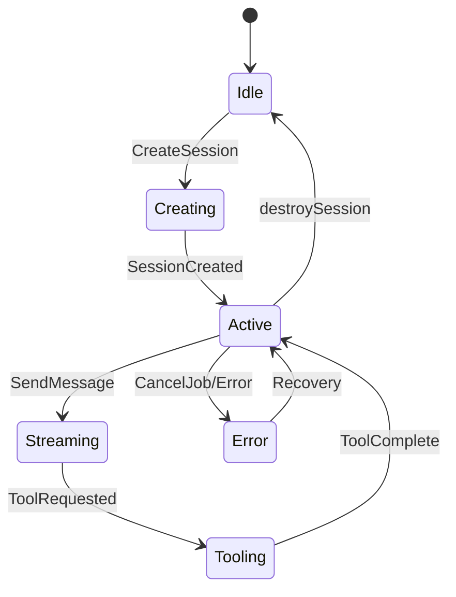
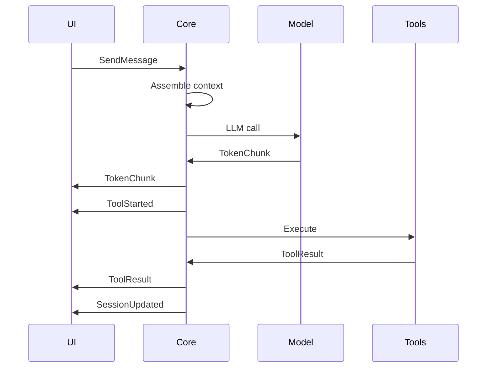
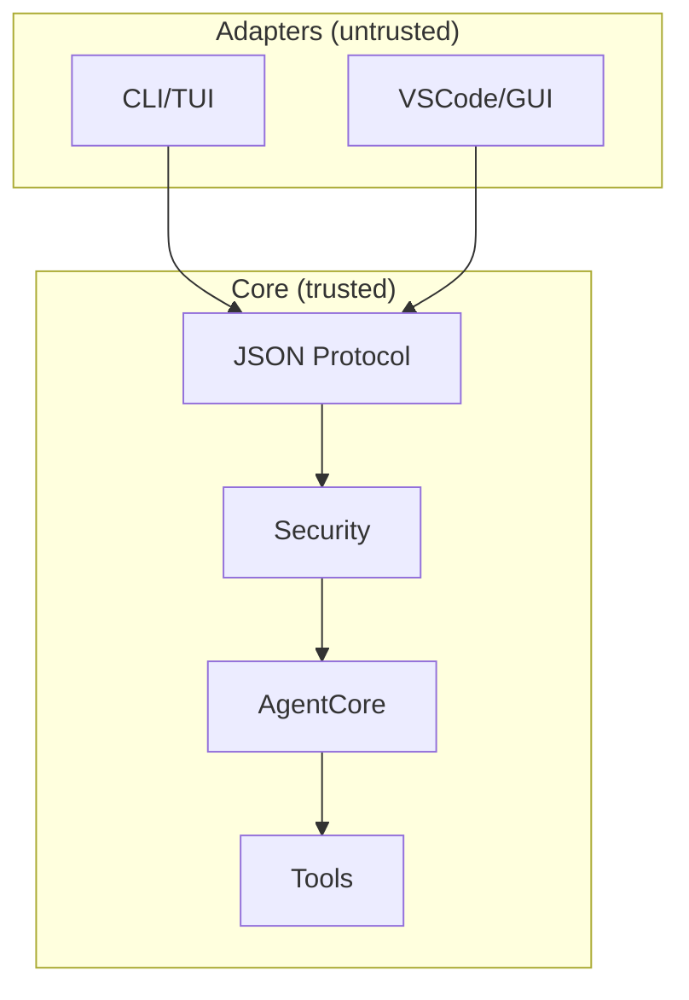

## 1\. FRD — Functional Requirements Document

## docs/FRD-001-Agent-Harness.md

markdown

```
# K-Universe Agent Harness FRD-001

## Purpose & Invariants

**Purpose**: Headless coding agent engine competing with Pi/OpenClaw, with swappable UI adapters via typed JSON protocol.

**Invariants**:
1. Core has zero UI imports or dependencies; protocol is the only UI boundary.
2. Security policy lives in core, enforced centrally before any tool/file op.
3. All state exposed to UI is pure JSON view models, renderable by any frontend.

## Subsystem Decomposition
```

text

`# K-Universe Agent Harness FRD-001 ## Purpose & Invariants **Purpose**: Headless coding agent engine competing with Pi/OpenClaw, with swappable UI adapters via typed JSON protocol. **Invariants**: 1. Core has zero UI imports or dependencies; protocol is the only UI boundary. 2. Security policy lives in core, enforced centrally before any tool/file op. 3. All state exposed to UI is pure JSON view models, renderable by any frontend. ## Subsystem Decomposition`

protocol/ - Typed JSON contracts (commands/events/state schemas)  
core/ - Headless engine (agent, sessions, tools, models, context, security)  
adapters/ - UI clients (CLI, VSCode, socket) consuming protocol only  
scripts/ - Install, scaffold, verify

text

````

## State Machine Diagram


## Command/Event Matrix

| Command | Triggers Events | Notes |
|---------|-----------------|-------|
| CreateSession | SessionUpdated | New session with initial state |
| SendMessage | TokenChunk, ToolStarted, SessionUpdated | Full agent loop |
| RunTool | ToolStarted, ToolResult | Policy-checked execution |
| CancelJob | JobComplete(successful: false) | Cooperative cancellation |
| destroySession | SessionUpdated (removed) | Idempotent cleanup |

## Acceptance Criteria

**Protocol**:
- All schemas validate round-trip JSON
- No `z.any()` except explicitly documented
- protocolVersion: "1.0" on all commands

**Core**:
- `createAgentCore()` returns fully initialized engine
- `sendMessage()` streams events without blocking
- `invokeTool()` respects security policy

**Adapters**:
- Zero business logic; protocol consumers only
- Can swap TUI ↔ GUI without core changes
````

text

``## State Machine Diagram ```mermaid stateDiagram-v2     [*] --> Idle    Idle --> Creating : CreateSession    Creating --> Active : SessionCreated    Active --> Streaming : SendMessage    Streaming --> Tooling : ToolRequested    Tooling --> Active : ToolComplete    Active --> Idle : destroySession    Active --> Error : CancelJob/Error    Error --> Active : Recovery ``` ## Command/Event Matrix | Command | Triggers Events | Notes | |---------|-----------------|-------| | CreateSession | SessionUpdated | New session with initial state | | SendMessage | TokenChunk, ToolStarted, SessionUpdated | Full agent loop | | RunTool | ToolStarted, ToolResult | Policy-checked execution | | CancelJob | JobComplete(successful: false) | Cooperative cancellation | | destroySession | SessionUpdated (removed) | Idempotent cleanup | ## Acceptance Criteria **Protocol**: - All schemas validate round-trip JSON - No `z.any()` except explicitly documented - protocolVersion: "1.0" on all commands **Core**: - `createAgentCore()` returns fully initialized engine - `sendMessage()` streams events without blocking - `invokeTool()` respects security policy **Adapters**: - Zero business logic; protocol consumers only - Can swap TUI ↔ GUI without core changes``

## 2\. Protocol Layer

## docs/protocol-spec.md

markdown

````
# Protocol Specification v1.0

## Command Catalog

| Command | Payload | Response Events |
|---------|---------|-----------------|
| CreateSession | projectId?, initialPrompt? | SessionUpdated |
| ListSessions | projectId? | SessionUpdated (list) |
| GetSessionState | sessionId | SessionUpdated (snapshot) |
| SendMessage | sessionId, content, modelId? | TokenChunk*, ToolStarted*, SessionUpdated |
| RunTool | sessionId, toolName, args | ToolStarted, ToolResult |
| SelectModel | sessionId, modelId | SessionUpdated (model change) |
| ApplyEdit | sessionId, editId | SessionUpdated |
| CancelJob | jobId | JobComplete(false) |

## Event Flow Diagram


## Security Boundaries

````

text

` # Protocol Specification v1.0 ## Command Catalog | Command | Payload | Response Events | |---------|---------|-----------------| | CreateSession | projectId?, initialPrompt? | SessionUpdated | | ListSessions | projectId? | SessionUpdated (list) | | GetSessionState | sessionId | SessionUpdated (snapshot) | | SendMessage | sessionId, content, modelId? | TokenChunk*, ToolStarted*, SessionUpdated | | RunTool | sessionId, toolName, args | ToolStarted, ToolResult | | SelectModel | sessionId, modelId | SessionUpdated (model change) | | ApplyEdit | sessionId, editId | SessionUpdated | | CancelJob | jobId | JobComplete(false) | ## Event Flow Diagram ```mermaid sequenceDiagram     UI->>Core: SendMessage    Core->>Core: Assemble context    Core->>Model: LLM call    Model->>Core: TokenChunk    Core->>UI: TokenChunk    Core->>UI: ToolStarted    Core->>Tools: Execute    Tools->>Core: ToolResult    Core->>UI: ToolResult    Core->>UI: SessionUpdated ``` ## Security Boundaries ```mermaid graph TD     subgraph "Adapters (untrusted)"        TUI[CLI/TUI]        GUI[VSCode/GUI]    end    subgraph "Core (trusted)"        PROTOCOL[JSON Protocol]        AGENT[AgentCore]        SEC[Security]        TOOLS[Tools]    end    TUI --> PROTOCOL    GUI --> PROTOCOL    PROTOCOL --> SEC    SEC --> AGENT    AGENT --> TOOLS ``` `

## src/protocol/commands.ts

typescript

```
import { z } from "zod";
import {
  SessionId,
  ProjectId,
  ToolName,
  ModelId,
  EditId,
  JobId,
} from "./state.js";

export type Command =
  | CreateSessionCommand
  | ListSessionsCommand
  | GetSessionStateCommand
  | SendMessageCommand
  | RunToolCommand
  | SelectModelCommand
  | ApplyEditCommand
  | CancelJobCommand;

export interface BaseCommand {
  protocolVersion: "1.0";
  commandId: string;
}

export interface CreateSessionCommand extends BaseCommand {
  type: "CreateSession";
  projectId?: ProjectId | null;
  initialPrompt?: string | null;
}

export interface ListSessionsCommand extends BaseCommand {
  type: "ListSessions";
  projectId?: ProjectId | null;
}

export interface GetSessionStateCommand extends BaseCommand {
  type: "GetSessionState";
  sessionId: SessionId;
}

export interface SendMessageCommand extends BaseCommand {
  type: "SendMessage";
  sessionId: SessionId;
  content: string;
  modelId?: ModelId | null;
  metadata?: Record<string, unknown> | null;
}

export interface RunToolCommand extends BaseCommand {
  type: "RunTool";
  sessionId: SessionId;
  toolName: ToolName;
  args: Record<string, unknown>;
}

export interface SelectModelCommand extends BaseCommand {
  type: "SelectModel";
  sessionId: SessionId;
  modelId: ModelId;
}

export interface ApplyEditCommand extends BaseCommand {
  type: "ApplyEdit";
  sessionId: SessionId;
  editId: EditId;
}

export interface CancelJobCommand extends BaseCommand {
  type: "CancelJob";
  jobId: JobId;
}

export const CommandSchema: z.ZodType<Command> = z.discriminatedUnion("type", [
  z.object({
    protocolVersion: z.literal("1.0"),
    commandId: z.string(),
    type: z.literal("CreateSession"),
    projectId: z.string().optional().nullable(),
    initialPrompt: z.string().optional().nullable(),
  }),
  z.object({
    protocolVersion: z.literal("1.0"),
    commandId: z.string(),
    type: z.literal("ListSessions"),
    projectId: z.string
```

typescript

`import { z } from "zod"; import {   SessionId,  ProjectId,  ToolName,  ModelId,  EditId,  JobId, } from "./state.js"; export type Command =   | CreateSessionCommand  | ListSessionsCommand  | GetSessionStateCommand  | SendMessageCommand  | RunToolCommand  | SelectModelCommand  | ApplyEditCommand  | CancelJobCommand; export interface BaseCommand {   protocolVersion: "1.0";  commandId: string; } export interface CreateSessionCommand extends BaseCommand {   type: "CreateSession";  projectId?: ProjectId | null;  initialPrompt?: string | null; } export interface ListSessionsCommand extends BaseCommand {   type: "ListSessions";  projectId?: ProjectId | null; } export interface GetSessionStateCommand extends BaseCommand {   type: "GetSessionState";  sessionId: SessionId; } export interface SendMessageCommand extends BaseCommand {   type: "SendMessage";  sessionId: SessionId;  content: string;  modelId?: ModelId | null;  metadata?: Record<string, unknown> | null; } export interface RunToolCommand extends BaseCommand {   type: "RunTool";  sessionId: SessionId;  toolName: ToolName;  args: Record<string, unknown>; } export interface SelectModelCommand extends BaseCommand {   type: "SelectModel";  sessionId: SessionId;  modelId: ModelId; } export interface ApplyEditCommand extends BaseCommand {   type: "ApplyEdit";  sessionId: SessionId;  editId: EditId; } export interface CancelJobCommand extends BaseCommand {   type: "CancelJob";  jobId: JobId; } export const CommandSchema: z.ZodType<Command> = z.discriminatedUnion("type", [   z.object({    protocolVersion: z.literal("1.0"),    commandId: z.string(),    type: z.literal("CreateSession"),    projectId: z.string().optional().nullable(),    initialPrompt: z.string().optional().nullable(),  }),  z.object({    protocolVersion: z.literal("1.0"),    commandId: z.string(),    type: z.literal("ListSessions"),    projectId: z.string`